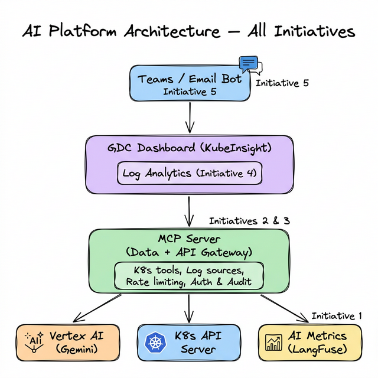
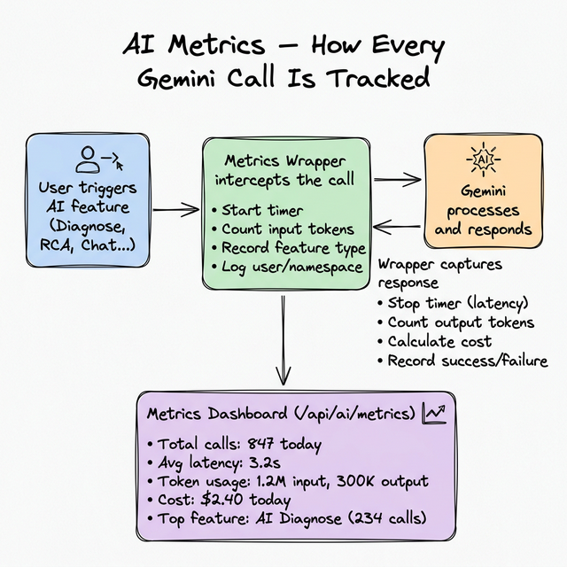
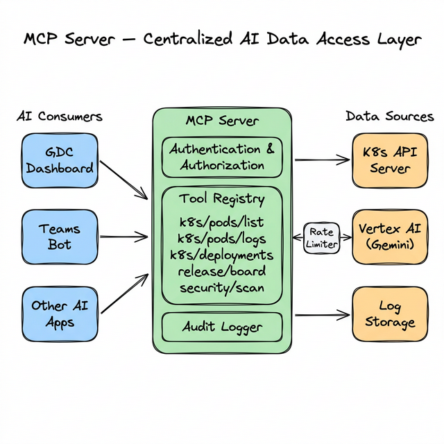
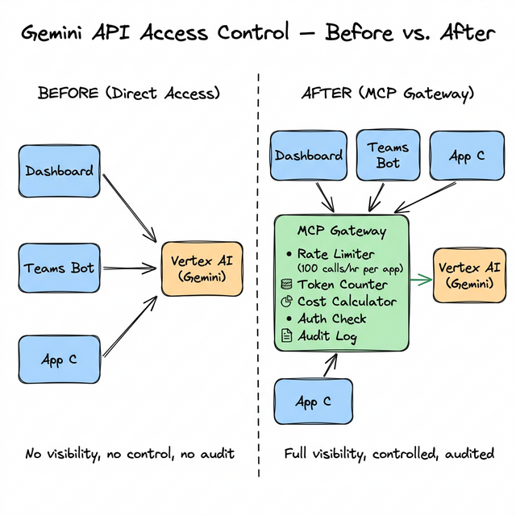
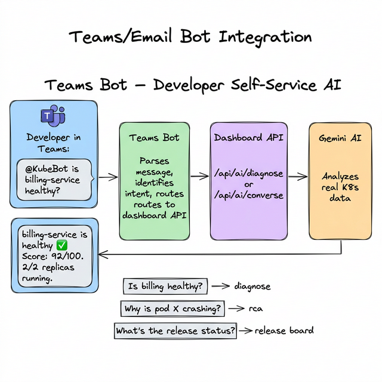
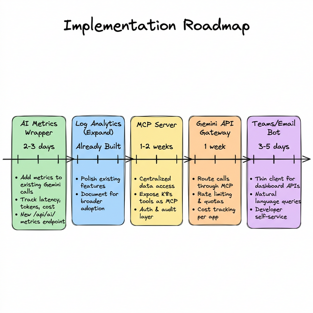

# AI Platform Initiatives — Detailed Plan

> **Purpose:** This document covers 5 strategic AI initiatives proposed by the team, explains the idea behind each, and details how they integrate with the GDC Dashboard (KubeInsight) project.

---

## How All Initiatives Connect



The GDC Dashboard sits at the center of the AI platform. Each initiative extends its capabilities:

| # | Initiative | What It Adds | Status |
|---|---|---|---|
| 1 | AI Metrics & Observability | Visibility into AI usage, cost, performance | New |
| 2 | MCP Server | Centralized, structured data access for AI agents | New |
| 3 | Gemini API Control via MCP | Governed, audited Gemini access | New |
| 4 | AI for Log Analytics | AI-powered log analysis on GDC | ✅ Already built in dashboard |
| 5 | AI for Developers (Teams/Email) | Self-service AI via chat interfaces | New |

---

## Initiative 1: AI Metrics & Observability

### The Idea

Today, the dashboard makes 15+ types of Gemini API calls (Diagnose, RCA, Chat, Security Audit, etc.), but there is **zero visibility** into:
- How many calls are made per day/week
- How long each call takes (latency)
- How many tokens are consumed (cost)
- Which features are used most
- Success vs. failure rates

**AI Observability** means instrumenting every Gemini call so you can monitor, optimize, and budget AI usage — just like you monitor CPU/memory for your microservices.

### Tools: LangSmith vs. LangFuse

| Feature | LangSmith | LangFuse |
|---|---|---|
| **Provider** | LangChain (commercial) | Open-source |
| **Hosting** | Cloud (langsmith.com) | Self-hosted on GDC ✅ |
| **LangChain Required?** | Designed for LangChain | Works with any LLM SDK |
| **Data Residency** | US cloud | Your cluster ✅ |
| **Cost** | Paid tiers | Free (self-hosted) |
| **Recommendation** | Only if org already uses it | **Best fit for GDC** — deploy in your cluster |

### How It Integrates with the Dashboard



### Implementation Plan

#### Phase 1A: Lightweight Built-In Metrics (quick win, 2-3 days)

Add a metrics wrapper directly in the dashboard — no external tools needed:

**New file: `ai_metrics.py`**

```python
import time
import threading
from collections import defaultdict

class AIMetrics:
    """Thread-safe AI call metrics collector."""
    
    def __init__(self):
        self._lock = threading.Lock()
        self._calls = []  # list of call records
        self._counters = defaultdict(int)
    
    def record_call(self, feature, input_tokens, output_tokens, 
                    latency_ms, success, namespace=""):
        with self._lock:
            self._calls.append({
                "timestamp": time.time(),
                "feature": feature,
                "input_tokens": input_tokens,
                "output_tokens": output_tokens,
                "latency_ms": latency_ms,
                "success": success,
                "namespace": namespace,
                "cost_usd": (input_tokens * 0.15 + output_tokens * 0.60) / 1_000_000
            })
            self._counters[feature] += 1
    
    def get_summary(self):
        with self._lock:
            if not self._calls:
                return {"total_calls": 0}
            
            today = [c for c in self._calls if c["timestamp"] > time.time() - 86400]
            return {
                "total_calls": len(self._calls),
                "calls_today": len(today),
                "total_input_tokens": sum(c["input_tokens"] for c in today),
                "total_output_tokens": sum(c["output_tokens"] for c in today),
                "total_cost_usd": round(sum(c["cost_usd"] for c in today), 4),
                "avg_latency_ms": round(sum(c["latency_ms"] for c in today) / max(len(today), 1)),
                "success_rate": round(sum(1 for c in today if c["success"]) / max(len(today), 1) * 100, 1),
                "by_feature": dict(self._counters),
            }

ai_metrics = AIMetrics()
```

**Usage in existing AI endpoints:**

```python
import time

# Wrap any existing Gemini call:
start = time.time()
try:
    response = model.generate_content(prompt)
    latency = (time.time() - start) * 1000
    ai_metrics.record_call(
        feature="diagnose",
        input_tokens=response.usage_metadata.prompt_token_count,
        output_tokens=response.usage_metadata.candidates_token_count,
        latency_ms=latency,
        success=True,
        namespace=namespace
    )
except Exception as e:
    ai_metrics.record_call(feature="diagnose", input_tokens=0,
                           output_tokens=0, latency_ms=0, success=False)
```

**New API endpoint:**

```python
@app.route('/api/ai/metrics')
def get_ai_metrics():
    return jsonify(ai_metrics.get_summary())
```

#### Phase 1B: LangFuse Integration (when org deploys it)

If the org deploys a central LangFuse instance, add the LangFuse SDK:

```python
from langfuse import Langfuse

langfuse = Langfuse(
    public_key="...",
    secret_key="...",
    host="https://langfuse.your-org.internal"
)

# Wrap Gemini calls with LangFuse tracing:
trace = langfuse.trace(name="diagnose", metadata={"namespace": ns})
generation = trace.generation(
    name="gemini-diagnose",
    model="gemini-2.5-flash",
    input=prompt,
)
response = model.generate_content(prompt)
generation.end(output=response.text)
```

### Metrics to Track

| Metric | Why It Matters |
|---|---|
| **Calls per feature** | Which AI features are most used? Prioritize optimization |
| **Latency (p50, p95, p99)** | Is Gemini responding fast enough? |
| **Token usage** | Are prompts efficient? Can they be shortened? |
| **Cost per day/week** | Budget tracking and forecasting |
| **Success rate** | Is Gemini failing? Network issues? |
| **Tokens per feature** | Which features are most expensive? |
| **Response quality** | Optional: user thumbs-up/down on AI responses |

---

## Initiative 2: MCP Server for AI Data Access

### The Idea

**Model Context Protocol (MCP)** is an open standard (by Anthropic, now widely adopted) that provides a structured way for AI models to access external tools and data. Think of it as a **universal API layer** between AI agents and your data sources.

**Why it matters:** Your dashboard already has 10+ K8s tools for the AI Chat agent. But these tools are locked inside the dashboard code. An MCP server **externalizes** them so:
- Multiple applications can share the same K8s data access
- Access is controlled and auditable
- Data is formatted consistently for AI consumption
- New AI apps don't need to re-implement K8s API calls

### Architecture



### What the Dashboard Already Has (MCP-Ready)

Your dashboard's existing AI Chat tools map directly to MCP tools:

| Dashboard Tool (Current) | MCP Tool (Future) | MCP URI |
|---|---|---|
| `k8s_list_pods` | List Pods | `mcp://k8s/pods/list` |
| `k8s_get_pod_logs` | Get Pod Logs | `mcp://k8s/pods/{name}/logs` |
| `k8s_get_pod_events` | Get Pod Events | `mcp://k8s/pods/{name}/events` |
| `k8s_describe_pod` | Describe Pod | `mcp://k8s/pods/{name}/describe` |
| `k8s_list_deployments` | List Deployments | `mcp://k8s/deployments/list` |
| `k8s_get_deployment_status` | Deployment Status | `mcp://k8s/deployments/{name}/status` |
| `k8s_list_services` | List Services | `mcp://k8s/services/list` |
| `k8s_get_configmap` | Get ConfigMap | `mcp://k8s/configmaps/{name}` |
| `k8s_get_namespace_events` | Namespace Events | `mcp://k8s/events/list` |
| `k8s_list_statefulsets` | List StatefulSets | `mcp://k8s/statefulsets/list` |
| *(new)* Security Scan | Security Scan | `mcp://k8s/security/scan` |
| *(new)* Release Board | Release Board | `mcp://release/current` |

### Implementation Plan

#### Option A: MCP Server as Sidecar (recommended for GDC)

Deploy the MCP server as a **separate container** alongside the dashboard:

```yaml
# Deployment with MCP sidecar
spec:
  containers:
    - name: gdc-dashboard
      image: gdc-dashboard:latest
      ports:
        - containerPort: 8080
    - name: mcp-server
      image: gdc-mcp-server:latest
      ports:
        - containerPort: 3000
      env:
        - name: KUBERNETES_NAMESPACE
          valueFrom:
            fieldRef:
              fieldPath: metadata.namespace
```

#### Option B: MCP Endpoints Inside Dashboard

Add MCP-compliant endpoints to the existing dashboard Flask app:

```python
@app.route('/mcp/tools', methods=['GET'])
def list_mcp_tools():
    """Return available MCP tools."""
    return jsonify({
        "tools": [
            {"name": "k8s_list_pods", "description": "List pods in namespace",
             "parameters": {"namespace": "string"}},
            {"name": "k8s_get_pod_logs", "description": "Get logs for a pod",
             "parameters": {"namespace": "string", "pod_name": "string"}},
            # ... all existing tools
        ]
    })

@app.route('/mcp/call', methods=['POST'])
def call_mcp_tool():
    """Execute an MCP tool call with auth and audit."""
    tool_name = request.json["tool"]
    params = request.json["parameters"]
    
    # Auth check
    if not validate_mcp_auth(request.headers):
        return jsonify({"error": "Unauthorized"}), 401
    
    # Audit log
    log_mcp_call(tool_name, params, request.headers.get("X-App-Id"))
    
    # Execute the existing tool function
    result = execute_k8s_tool(tool_name, params)
    return jsonify({"result": result})
```

### Key Capabilities

| Capability | Implementation |
|---|---|
| **Structured Data** | JSON responses with consistent schema |
| **Context** | Include namespace, cluster info, timestamps |
| **Auth** | Service account tokens or API keys per consumer |
| **Audit** | Log every tool call: who, what, when, response size |
| **Rate Limiting** | Per-consumer limits (e.g., 100 calls/min for Teams bot) |

---

## Initiative 3: Gemini API Access Control via MCP

### The Idea

Instead of every application calling Gemini directly, **route ALL Gemini calls through a central gateway** (the MCP server). This gives complete visibility and control over AI API usage.

### Before vs. After



### What the Gateway Controls

| Control | How It Works |
|---|---|
| **Usage Auditing** | Every call logged: app, feature, tokens, cost, timestamp |
| **Rate Limiting** | Per-app limits (e.g., dashboard: 200/hr, Teams bot: 50/hr) |
| **Quotas** | Monthly token budgets per app/team |
| **Cost Tracking** | Real-time cost per app: `dashboard: $2.40/day, teams-bot: $0.80/day` |
| **Auth** | Only authorized service accounts can call Gemini |
| **Model Routing** | Route expensive calls to Flash, complex calls to Pro |
| **Fallback** | If Gemini is down, return cached responses or graceful errors |

### Implementation for the Dashboard

Modify the dashboard's `get_model()` function to route through the gateway:

```python
# Current (direct):
from google import genai
client = genai.Client(vertexai=True, project=project, location=region)

# With MCP Gateway:
class GeminiViaGateway:
    """Routes Gemini calls through MCP gateway for auditing."""
    
    def __init__(self, gateway_url, app_id):
        self.gateway_url = gateway_url
        self.app_id = app_id
    
    def generate_content(self, prompt, config=None):
        response = requests.post(
            f"{self.gateway_url}/api/gemini/generate",
            json={
                "prompt": prompt,
                "config": config,
                "app_id": self.app_id,
                "feature": current_feature_name,
            },
            headers={"Authorization": f"Bearer {self.api_key}"}
        )
        return response.json()
```

### Cost Visibility Dashboard

The gateway would provide a cost dashboard:

| App | Calls Today | Input Tokens | Output Tokens | Cost Today | Monthly Projected |
|---|---|---|---|---|---|
| gdc-dashboard | 847 | 1.2M | 300K | $2.40 | $72.00 |
| teams-bot | 234 | 400K | 100K | $0.72 | $21.60 |
| ci-pipeline | 50 | 80K | 20K | $0.13 | $3.90 |
| **Total** | **1,131** | **1.68M** | **420K** | **$3.25** | **$97.50** |

---

## Initiative 4: AI for Log Analytics

### The Idea

AI-powered log analysis to accelerate incident response and root cause analysis. This is about **making the dashboard's existing AI log features the foundation** for broader GDC log analytics.

### What the Dashboard Already Has ✅

| Feature | Status | API Endpoint |
|---|---|---|
| **Log Summarization** | ✅ Built | `POST /api/ai/summarize_logs` |
| **Multi-Container Log Correlation** | ✅ Built | `POST /api/ai/correlate_logs` |
| **AI Root Cause Analysis** | ✅ Built | `POST /api/ai/rca` |
| **AI Diagnose** (includes log analysis) | ✅ Built | `POST /api/ai/diagnose` |

### What Can Be Expanded

| Enhancement | Description | Effort |
|---|---|---|
| **Cross-Namespace Log Correlation** | Correlate logs across microservices in different namespaces | Medium |
| **Log Pattern Library** | AI builds a library of known error patterns and their fixes | Medium |
| **Anomaly Detection** | Continuous monitoring: alert when log patterns change | Large |
| **Historical Analysis** | Compare current logs with "normal" baseline from last week | Large |
| **Integration with MCP** | Expose log analysis as MCP tools for other apps to use | Small |

### How Other Teams Can Use It

Via MCP (Initiative 2), other applications can call the dashboard's log analysis:

```
MCP Tool: analyze_logs
Input: { "namespace": "billing", "pod": "billing-api-xyz", "lines": 500 }
Output: {
  "summary": "47 timeout errors in last 5 min, DB connection pool exhausted",
  "severity": "critical",
  "root_cause": "Connection pool max (10) reached under load",
  "fix": "Increase pool size in ConfigMap: MAX_POOL_SIZE=25"
}
```

---

## Initiative 5: AI for Common Developer Problems (Teams/Email)

### The Idea

Developers shouldn't need to open the dashboard for every question. A **Teams bot** (or email integration) acts as a thin client to the dashboard's existing AI APIs, enabling self-service:

### How It Works



### Supported Queries

| What Developer Asks | Dashboard API Used | Response |
|---|---|---|
| "Is billing-service healthy?" | `/api/ai/diagnose` | Health score + status |
| "Why is pod X crashing?" | `/api/ai/rca` | Root cause + fix |
| "Show me crashing pods" | `/api/ai/query` | Filtered list |
| "What's in this Friday's release?" | `/api/release/current` | Release board summary |
| "Scale frontend to 3 replicas" | `/api/scale` | Confirmation + done |
| "Any security issues?" | `/api/ai/security_scan` | Risk summary |
| "Analyze billing-service logs" | `/api/ai/summarize_logs` | Log summary |
| "Generate a Redis deployment YAML" | `/api/ai/generate_yaml` | YAML output |

### Implementation Architecture

The Teams bot is a **thin client** — no AI logic in the bot itself:

```python
# Teams Bot (Azure Bot Framework or similar)
@bot.on_message
async def handle_message(context):
    user_question = context.activity.text
    
    # Option A: Route to dashboard's AI Chat (simplest)
    response = requests.post(
        f"{DASHBOARD_URL}/api/ai/converse",
        json={"message": user_question, "namespace": user_namespace},
        headers={"X-Session-Id": context.activity.from_id}
    )
    
    await context.send_activity(response.json()["response"])
```

**Why this is elegant:** Your dashboard's `/api/ai/converse` endpoint already handles natural language → K8s tool calls → Gemini reasoning → answer. The Teams bot just forwards the message and returns the answer. Zero AI duplication.

### Email Integration (Alternative)

For orgs that prefer email:

```
Developer emails: ops-bot@company.com
Subject: "Is billing-service healthy in staging?"

Bot reads email → calls /api/ai/diagnose → replies:
"billing-service is healthy (92/100). 2/2 replicas. No restarts in 48h."
```

---

## Implementation Roadmap



### Detailed Phase Breakdown

| Phase | Initiative | Deliverables | Effort | Dependencies |
|---|---|---|---|---|
| **Phase 1** | AI Metrics (built-in) | `ai_metrics.py`, `/api/ai/metrics` endpoint, metrics UI panel | 2-3 days | None — can start immediately |
| **Phase 2** | Log Analytics (expand) | Document existing features, cross-namespace support | Already built + 2-3 days | None |
| **Phase 3** | MCP Server | Tool registry, auth layer, audit logging, MCP-compliant API | 1-2 weeks | K8s service account |
| **Phase 4** | Gemini API Gateway | Route Gemini calls through MCP, rate limiting, cost tracking | 1 week | Phase 3 (MCP Server) |
| **Phase 5** | Teams/Email Bot | Bot registration, message routing, response formatting | 3-5 days | Phase 3 (MCP for auth) |

### What to Build First (Quick Wins)

**Start with Phase 1 (AI Metrics)** because:
- Zero external dependencies
- Adds value to existing features immediately
- Provides data to justify Phases 3-5 ("we're making 847 calls/day, costing $X")
- Impressive for the engineering award submission
- Can be built in 2-3 days

---

## API Endpoints Summary (All Initiatives)

### Existing Dashboard Endpoints (Initiative 4 — already built)

| Endpoint | Method | Purpose |
|---|---|---|
| `/api/ai/diagnose` | `POST` | AI health check for a workload |
| `/api/ai/rca` | `POST` | Root cause analysis |
| `/api/ai/summarize_logs` | `POST` | AI log summarization |
| `/api/ai/correlate_logs` | `POST` | Multi-container log correlation |
| `/api/ai/converse` | `POST` | Conversational AI agent (chat) |
| `/api/ai/query` | `POST` | Natural language search |
| `/api/ai/security_scan` | `GET` | AI security audit |
| `/api/ai/optimize` | `GET` | Resource optimization |

### New Endpoints (Initiatives 1, 2, 3)

| Endpoint | Method | Initiative | Purpose |
|---|---|---|---|
| `/api/ai/metrics` | `GET` | 1 | AI usage metrics summary |
| `/api/ai/metrics/by_feature` | `GET` | 1 | Breakdown by feature |
| `/api/ai/metrics/cost` | `GET` | 1 | Cost tracking |
| `/mcp/tools` | `GET` | 2 | List available MCP tools |
| `/mcp/call` | `POST` | 2 | Execute an MCP tool |
| `/mcp/audit` | `GET` | 2, 3 | View audit log |
| `/mcp/gemini/generate` | `POST` | 3 | Gemini calls via gateway |
| `/mcp/gemini/usage` | `GET` | 3 | Per-app Gemini usage |
| `/mcp/gemini/quotas` | `GET/PUT` | 3 | Manage rate limits/quotas |

---

## How This Strengthens the Engineering Award

These initiatives transform the dashboard from a **single-team tool** into a **platform**:

| Before (Current) | After (With All Initiatives) |
|---|---|
| Dashboard used by DevOps team only | Platform used by developers, support, management |
| AI calls are invisible | Full observability: cost, latency, usage patterns |
| AI features locked in dashboard UI | Accessible via Teams, email, API, MCP |
| No governance over AI usage | Rate limiting, quotas, audit logging |
| Log analysis in dashboard only | Log analysis as a shared service via MCP |

This positions the project as the **AI Operations Platform for GDC** — not just a dashboard, but the foundation for AI-powered operations across the organization.
