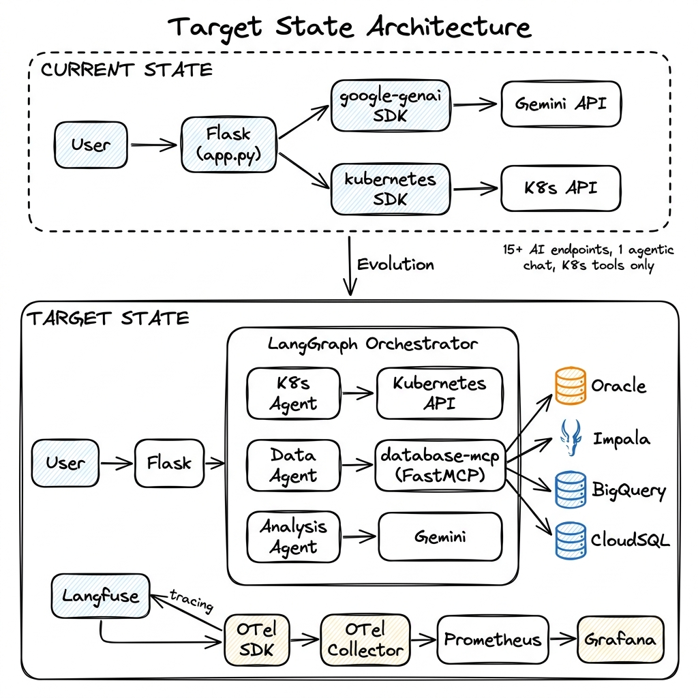
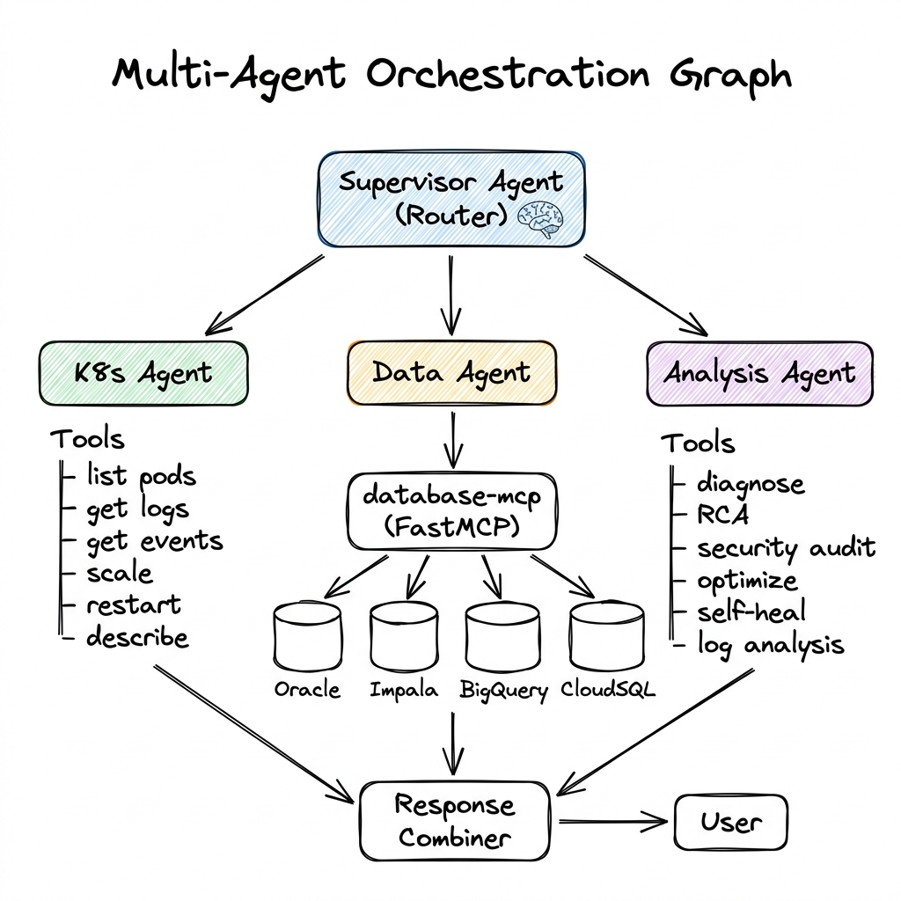
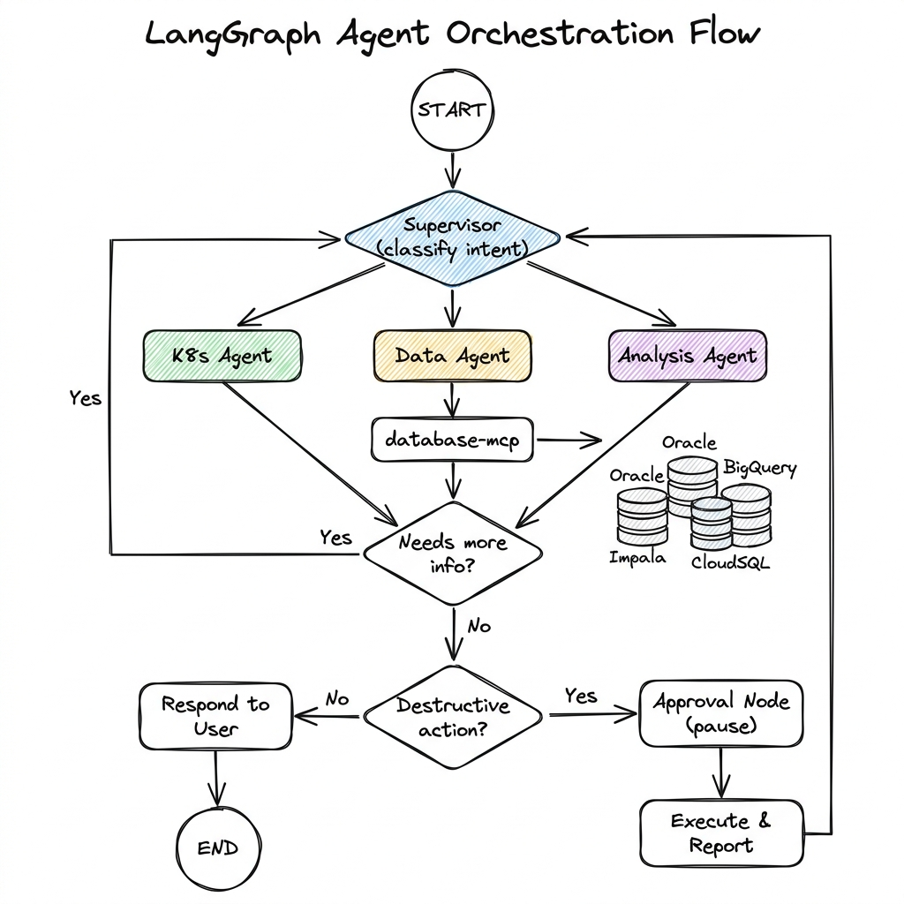
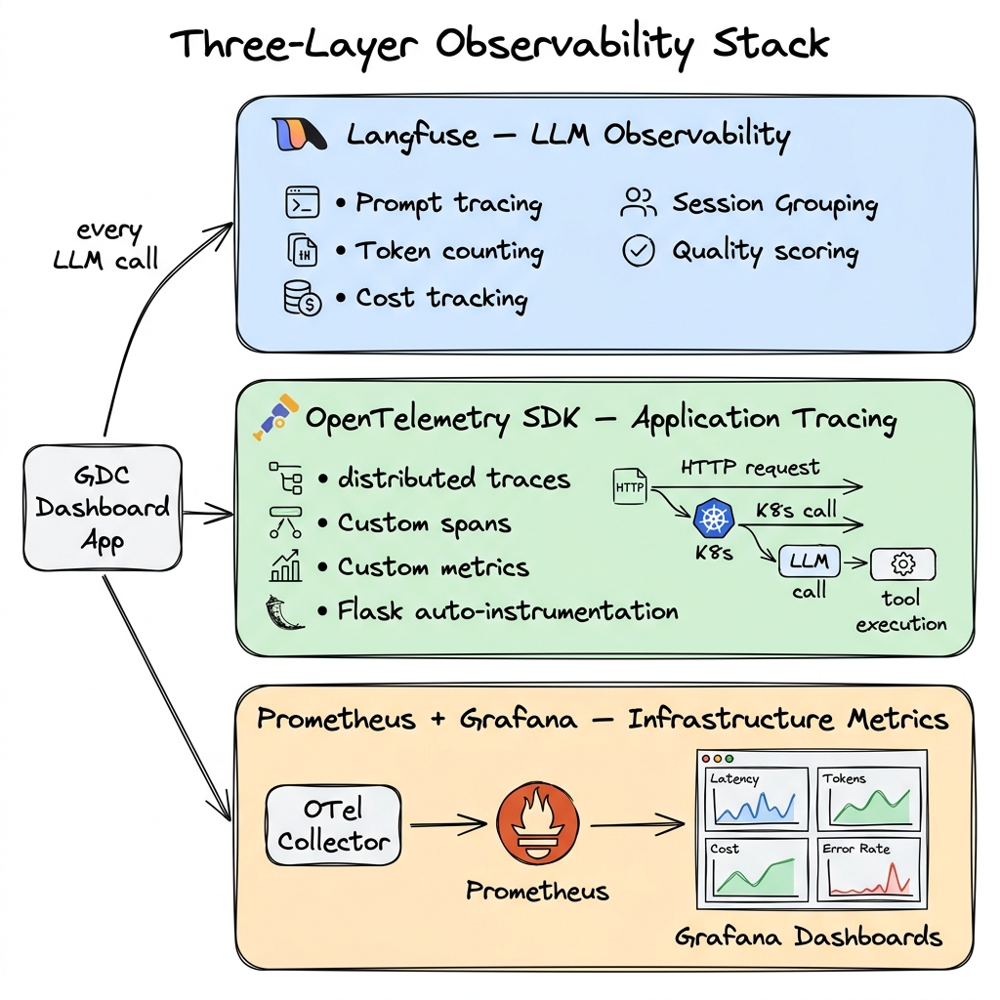
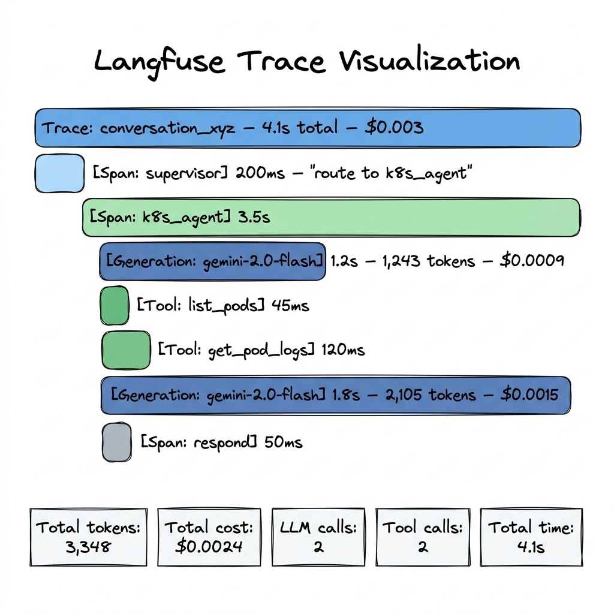
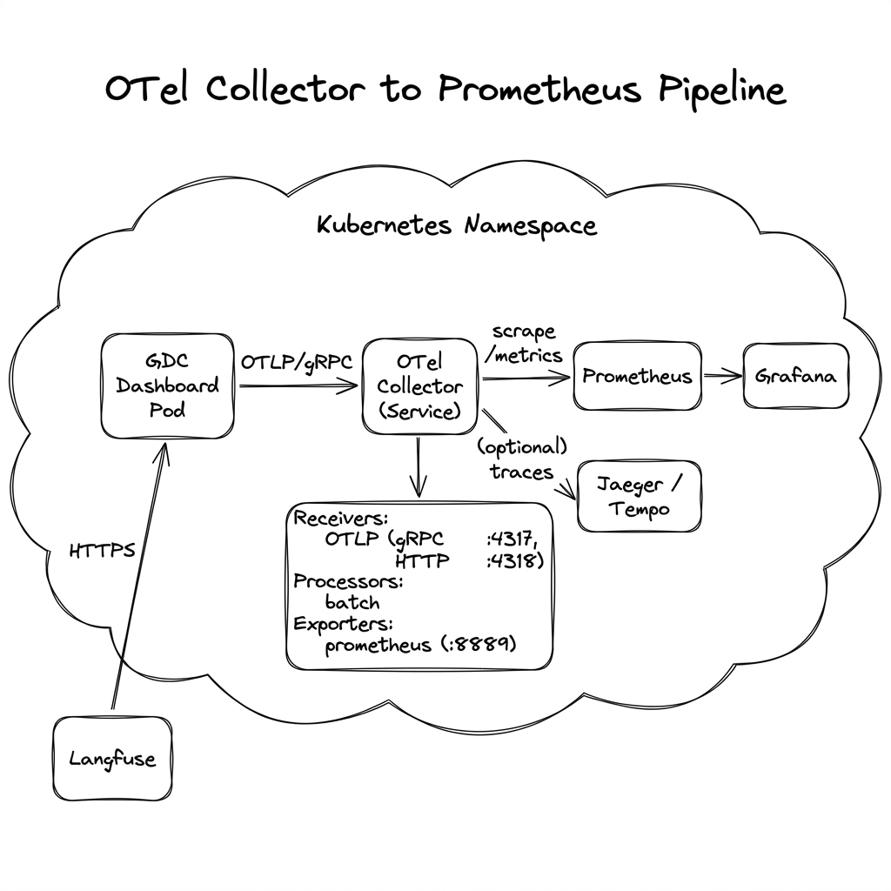
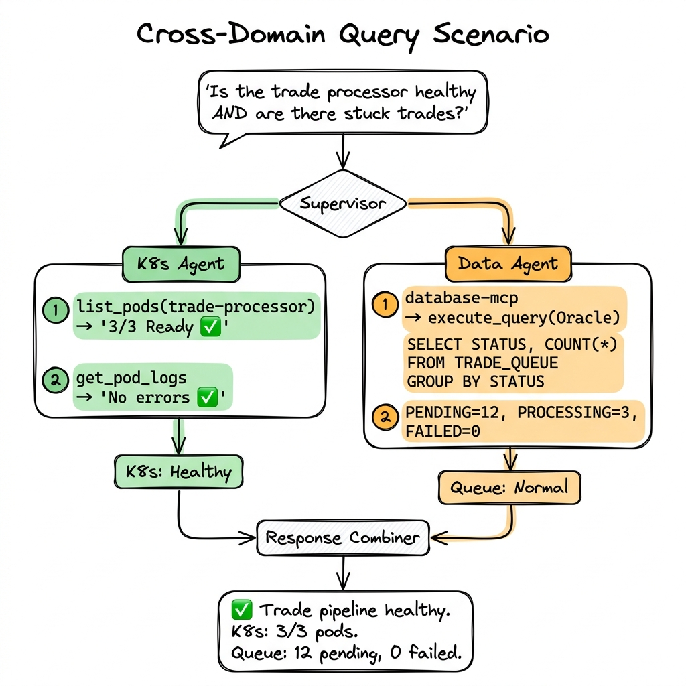

# AI Orchestration, Observability & Data Integration — Architecture Plan

> **Status:** Design Document (not yet implemented)
> **Last Updated:** 2026-06-23
> **Audience:** Engineering team, architecture reviewers, stakeholders

---

## 1. Executive Summary

This document outlines the architecture for evolving the GDC Dashboard's AI capabilities from a single-purpose Kubernetes assistant into a **unified intelligent operations platform** that can:

1. **Query enterprise databases** — Oracle, Impala, BigQuery, CloudSQL via the `database-mcp` server
2. **Orchestrate multi-domain workflows** — combine K8s ops + business data queries in a single conversation
3. **Observe everything** — full tracing of every LLM call, tool invocation, and request via Langfuse + OpenTelemetry
4. **Build dashboards** — export metrics to Prometheus via OTel Collector for Grafana dashboards



<details>
<summary>Text version</summary>

```
CURRENT STATE:
  User → Flask → google-genai SDK → Gemini
               → kubernetes SDK   → K8s API
  15+ AI endpoints, 1 agentic chat, K8s tools only

TARGET STATE:
  User → Flask → LangGraph Orchestrator → Gemini (via LangChain)
                    ├── K8s Agent ─────────→ Kubernetes API
                    ├── Data Agent ────────→ database-mcp (FastMCP)
                    │     ├── Oracle, Impala, BigQuery, CloudSQL
                    └── Cross-Domain Agent → combines K8s + data results
  Langfuse ← traces | OTel SDK → OTel Collector → Prometheus → Grafana
```

</details>

---

## 2. Orchestration Architecture — LangGraph

### 2.1 Why LangGraph (Not the Current Custom Loop)

The current `/api/ai/converse` endpoint uses a hand-rolled agent loop:
- Linear: call Gemini → execute tools → call Gemini → ... (up to 5 iterations)
- No branching or conditional routing
- No state persistence across requests
- No human-in-the-loop for destructive actions
- Only K8s tools — no database or business tools

**LangGraph provides:**

| Capability | Current State | With LangGraph |
|---|---|---|
| Agent loop | Custom while-loop (5 iterations max) | Graph-based state machine (unlimited) |
| Tool routing | Single flat list (10 K8s tools) | Multiple specialized tool groups |
| Branching | None — always linear | Conditional edges (route by intent) |
| State | In-memory per-request | Persistent graph state with checkpoints |
| Human-in-loop | Confirmation dialog (UI-level) | Graph pause + resume at approval nodes |
| Multi-agent | Single agent | Supervisor → specialized sub-agents |
| Error recovery | Try/except per tool | Retry nodes, fallback edges |
| Cross-domain | K8s only | K8s + databases + business logic |

### 2.2 Multi-Agent Graph Architecture



**How the Supervisor routes:**

```
User: "Why is billing-service slow?"
  → Supervisor identifies: K8s operational question
  → Routes to: K8s Agent
  → K8s Agent: list pods → get logs → get events → respond

User: "How many trades were settled yesterday?"
  → Supervisor identifies: Business data question
  → Routes to: Data Agent
  → Data Agent: calls database-mcp execute_query on Oracle → respond

User: "Is the trade processing service healthy and are there any
       stuck trades in the Oracle TRADES table?"
  → Supervisor identifies: Cross-domain question (K8s + data)
  → Routes to: K8s Agent first → then Data Agent
  → K8s Agent: checks trade-processor deployment health
  → Data Agent: queries SELECT * FROM TRADES WHERE STATUS='PENDING'
  → Supervisor: combines both results into unified answer
```

### 2.3 The Orchestration Graph in Detail



### 2.4 Database-MCP Integration (Data Agent)

The Data Agent connects to the `database-mcp` FastMCP server to execute business queries. The database-mcp exposes 8 tools:

| database-mcp Tool | Data Agent Use Case |
|---|---|
| `list_databases` | "What databases are available?" |
| `list_schemas` | "What schemas does Oracle have?" |
| `list_tables` | "Show me the tables in the TRADING schema" |
| `describe_table` | "What columns does the TRADES table have?" |
| `execute_query` | "How many trades were settled yesterday?" |
| `get_sample_data` | "Show me sample data from the POSITIONS table" |
| `get_schema_context` | Auto-called to understand schema before generating SQL |
| `health_check` | Verify database connectivity before querying |

**Data Agent Workflow:**

```
User: "What's the total notional value of unsettled trades?"

Data Agent:
  1. Calls get_schema_context(database="oracle", schema="TRADING")
     → Gets full schema with column types, PKs
  2. Generates SQL from natural language using schema context:
     SELECT SUM(QUANTITY * PRICE) AS total_notional
     FROM TRADING.TRADES
     WHERE TRADE_STATUS != 'SETTLED'
  3. Calls execute_query(database="oracle", sql=<generated SQL>)
     → Gets result: [{"total_notional": 45830219.50}]
  4. Formats response: "The total notional value of unsettled
     trades is $45,830,219.50 across Oracle."
```

**Cross-Database Query Example:**

```
User: "Compare Oracle trade volumes with BigQuery reporting totals for today"

Data Agent:
  1. Calls execute_query(database="oracle",
       sql="SELECT COUNT(*) as cnt FROM TRADING.TRADES
            WHERE TRADE_DATE = TRUNC(SYSDATE)")
     → Oracle: 15,230 trades

  2. Calls execute_query(database="bigquery",
       sql="SELECT COUNT(*) as cnt FROM trading.trade_summary
            WHERE report_date = CURRENT_DATE()")
     → BigQuery: 15,228 trades

  3. Compares and responds:
     "Oracle shows 15,230 trades today. BigQuery reporting shows 15,228.
      There's a discrepancy of 2 trades that may not have been
      replicated yet."
```

### 2.5 Existing AI Features — Migration Path

The 15+ existing direct-prompt AI endpoints (`/api/ai/diagnose`, `/api/ai/rca`, etc.) do **not** need to be rewritten. They continue working as-is.

LangGraph enhances only the **agentic conversation** (`/api/ai/converse`):

| Component | Change |
|---|---|
| `/api/ai/diagnose` | **No change** — stays as direct prompt |
| `/api/ai/rca` | **No change** — stays as direct prompt |
| `/api/ai/security_scan` | **No change** — stays as direct prompt |
| `/api/ai/optimize` | **No change** — stays as direct prompt |
| All other `/api/ai/*` | **No change** — stays as direct prompt |
| `/api/ai/converse` | **REPLACED** by LangGraph agent graph |
| `/api/ai/query` (search bar) | **Enhanced** — can now route to Data Agent |

However, the Analysis Agent within LangGraph can **reuse the same prompt logic** from existing endpoints as tools:

```
Analysis Agent Tools:
  - diagnose_workload(name)     → reuses /api/ai/diagnose logic
  - root_cause_analysis(name)   → reuses /api/ai/rca logic
  - security_scan()             → reuses /api/ai/security_scan logic
  - optimize_resources()        → reuses /api/ai/optimize logic
```

This means the chat agent can say:
```
User: "Run a security scan and check for any unauthorized transactions in Oracle"

Supervisor → Analysis Agent: security_scan()
Supervisor → Data Agent: execute_query(oracle,
    "SELECT * FROM AUDIT.ACCESS_LOG WHERE action='UNAUTHORIZED'")
Supervisor: combines both results
```

---

## 3. Observability Architecture

### 3.1 Three Layers of Observability



### 3.2 Langfuse — LLM Observability

**Purpose:** Trace every AI interaction at the LLM level — what prompt went in, what came out, how many tokens, how long, how much it cost, and whether the output was good.

**What gets traced:**

| Trace Point | Data Captured |
|---|---|
| Every Gemini API call | Input prompt, output text, model, temperature |
| Token usage | Input tokens, output tokens, total tokens |
| Latency | Time from request to response (ms) |
| Cost | Calculated from token counts × model pricing |
| Tool calls (LangGraph) | Which tools the agent chose, inputs, outputs |
| Sessions | Multi-turn conversations grouped by session ID |
| Errors | Timeouts, rate limits, hallucination flags |
| User feedback | Thumbs up/down on AI responses (if implemented) |

**Langfuse + LangGraph integration:**

Langfuse has native LangChain/LangGraph integration via a callback handler:



**Langfuse + existing direct-prompt endpoints:**

```
Direct Prompt Endpoint (/api/ai/diagnose)
  ├── [Trace: diagnose_billing-service]
  │   ├── [Span: collect_k8s_data] latency=200ms
  │   ├── [Generation: gemini-2.0-flash]
  │   │   input_tokens=3,421 output_tokens=892
  │   │   cost=$0.001 latency=2.1s
  │   └── [Span: parse_response] latency=5ms
```

**Langfuse Deployment:**

| Option | Pros | Cons |
|---|---|---|
| **langfuse.com (cloud)** | Zero ops, instant setup | Data leaves cluster |
| **Self-hosted (K8s in namespace)** | Data stays in cluster, full control | Needs PostgreSQL, maintenance |
| **Self-hosted (shared cluster)** | Central for all teams | Cross-namespace networking |

### 3.3 OpenTelemetry SDK — Application Tracing

**Purpose:** Instrument the entire Flask application — not just AI calls, but all HTTP requests, K8s API calls, and database-mcp interactions.

**Trace Flow:**

```
User clicks "Diagnose"
  │
  ├── [Trace: HTTP POST /api/ai/diagnose]
  │   ├── [Span: flask.request] method=POST path=/api/ai/diagnose
  │   ├── [Span: collect_k8s_data]
  │   │   ├── [Span: k8s.list_pods] latency=45ms
  │   │   ├── [Span: k8s.read_pod_log] latency=120ms
  │   │   └── [Span: k8s.list_events] latency=30ms
  │   ├── [Span: build_prompt] tokens=3,421
  │   ├── [Span: gemini.generate] latency=2100ms model=gemini-2.0-flash
  │   └── [Span: parse_response] latency=5ms
  │
  └── Total: 2,300ms
```

**For LangGraph agentic calls with database-mcp:**

```
User asks "Compare Oracle trades with BigQuery"
  │
  ├── [Trace: HTTP POST /api/ai/converse]
  │   ├── [Span: langgraph.supervisor] intent=cross_domain
  │   ├── [Span: langgraph.data_agent]
  │   │   ├── [Span: gemini.generate] → "I need to query both databases"
  │   │   ├── [Span: database_mcp.get_schema_context] db=oracle latency=80ms
  │   │   ├── [Span: gemini.generate] → generates Oracle SQL
  │   │   ├── [Span: database_mcp.execute_query] db=oracle latency=450ms
  │   │   ├── [Span: database_mcp.execute_query] db=bigquery latency=1200ms
  │   │   └── [Span: gemini.generate] → compares results
  │   └── [Span: respond] total_latency=4.8s
```

### 3.4 OTel Collector → Prometheus Pipeline



**OTel Collector configuration:**

```
Receivers:  OTLP (gRPC :4317, HTTP :4318)
Processors: batch (5s timeout, 1024 batch size)
Exporters:
  - prometheus (metrics → :8889/metrics for Prometheus to scrape)
  - otlp/traces (optional → Jaeger/Tempo for trace visualization)
```

### 3.5 Prometheus Metrics (Grafana Dashboard)

**AI Operations Dashboard:**

| Metric Name | Type | Labels | Dashboard Panel |
|---|---|---|---|
| `gdc_ai_requests_total` | Counter | endpoint, status | Requests/min by feature |
| `gdc_ai_request_duration_ms` | Histogram | endpoint | P50/P95/P99 latency |
| `gdc_ai_tokens_total` | Counter | model, direction (in/out) | Token consumption rate |
| `gdc_ai_cost_usd` | Counter | endpoint, model | Cost per feature |
| `gdc_ai_errors_total` | Counter | endpoint, error_type | Error rate |
| `gdc_ai_tool_calls_total` | Counter | tool_name, agent | Tool usage by agent |
| `gdc_ai_tool_duration_ms` | Histogram | tool_name | Tool execution latency |
| `gdc_ai_sessions_active` | Gauge | — | Active chat sessions |
| `gdc_db_query_duration_ms` | Histogram | database, db_type | database-mcp query latency |
| `gdc_db_query_rows_total` | Counter | database | Rows returned |

**Example Grafana Dashboard Panels:**

```
┌─────────────────────────────────────────────────────────────────┐
│  AI Operations Dashboard                              [1h ▾]   │
├──────────────┬──────────────┬──────────────┬──────────────────┤
│ AI Calls/min │ P95 Latency  │ Token Rate   │ Est. Daily Cost  │
│    12.4      │   3.2s       │  42K tok/min │    $4.80         │
├──────────────┴──────────────┴──────────────┴──────────────────┤
│  [Chart: Request Rate by Feature]                             │
│  ████ diagnose: 4.2/min                                       │
│  ███  converse: 3.8/min                                       │
│  ██   rca: 2.1/min                                            │
│  █    security_scan: 1.4/min                                  │
├───────────────────────────────────────────────────────────────┤
│  [Chart: P95 Latency by Feature]         [Chart: Error Rate] │
│  diagnose ████ 2.1s                      0.3% error rate      │
│  converse █████████ 4.8s                 1.2% timeout rate    │
│  rca ██████ 3.5s                                              │
├───────────────────────────────────────────────────────────────┤
│  [Chart: Database Query Latency]         [Chart: Tool Usage] │
│  Oracle  ███ 450ms avg                   list_pods: 38%       │
│  BigQuery ████████ 1.2s avg              get_logs: 25%        │
│  Impala  █████ 800ms avg                 execute_query: 20%   │
│  CloudSQL ██ 120ms avg                   describe_table: 17%  │
└───────────────────────────────────────────────────────────────┘
```

---

## 4. End-to-End User Scenarios

### Scenario 1: Pure Kubernetes (current behavior, enhanced)

```
User: "Why is billing-service crashing?"

Supervisor → routes to K8s Agent
  K8s Agent:
    1. list_pods(namespace) → finds billing-service-abc123 in CrashLoopBackOff
    2. get_pod_logs(billing-service-abc123) → OOMKilled in container app
    3. get_pod_events(billing-service-abc123) → 5 OOMKilled in last 10min

  Response: "billing-service-abc123 is in CrashLoopBackOff due to OOMKilled.
  The app container is exceeding its 256Mi memory limit. Recommendation:
  increase memory limit to 512Mi."

Langfuse trace: 3 tool calls, 2 LLM generations, $0.003, 4.1s total
OTel metrics: gdc_ai_requests_total{endpoint="converse"} +1
```

### Scenario 2: Pure Business Data

```
User: "Show me the top 10 counterparties by trade volume this week"

Supervisor → routes to Data Agent
  Data Agent:
    1. get_schema_context(oracle, "TRADING") → understands TRADES table schema
    2. Generates SQL:
       SELECT COUNTERPARTY_ID, COUNT(*) as trade_count,
              SUM(QUANTITY * PRICE) as total_notional
       FROM TRADING.TRADES
       WHERE TRADE_DATE >= TRUNC(SYSDATE) - 7
       GROUP BY COUNTERPARTY_ID
       ORDER BY total_notional DESC
       FETCH FIRST 10 ROWS ONLY
    3. execute_query(oracle, <sql>) → returns top 10 results

  Response: [Formatted table of top 10 counterparties]

Langfuse trace: 1 MCP call, 2 LLM generations, $0.002, 3.5s total
OTel metrics: gdc_db_query_duration_ms{database="oracle"} 450ms
```

### Scenario 3: Cross-Domain (K8s + Data)



```
User: "Is the trade processing pipeline healthy? Check both the K8s
       service and whether there are stuck trades in the queue."

Supervisor → routes to BOTH K8s Agent AND Data Agent
  K8s Agent:
    1. list_pods(trade-processor) → 3/3 replicas Ready
    2. get_pod_logs(trade-processor-xxx) → no errors in last 5min
    → K8s verdict: "trade-processor is healthy, 3/3 pods running"

  Data Agent:
    1. execute_query(oracle,
         "SELECT STATUS, COUNT(*) FROM TRADING.TRADE_QUEUE
          GROUP BY STATUS") → PENDING: 12, PROCESSING: 3, FAILED: 0
    → Data verdict: "12 pending, 3 processing, 0 failed — queue is normal"

  Supervisor combines:
    "✅ Trade processing pipeline is healthy.
     K8s: 3/3 pods running, no errors.
     Queue: 12 pending (normal), 3 processing, 0 failed.
     No action needed."

Langfuse trace: 4 tool calls, 4 LLM generations, $0.005, 5.2s total
```

### Scenario 4: Cross-Database Analysis

```
User: "Are Oracle trade counts matching BigQuery reporting for today?"

Supervisor → Data Agent
  Data Agent:
    1. execute_query(oracle,
         "SELECT COUNT(*) FROM TRADING.TRADES
          WHERE TRADE_DATE = TRUNC(SYSDATE)") → 15,230
    2. execute_query(bigquery,
         "SELECT COUNT(*) FROM trading.trade_summary
          WHERE report_date = CURRENT_DATE()") → 15,228
    3. Compares and reports:
       "Oracle: 15,230 | BigQuery: 15,228 | Delta: 2 trades
        The 2-trade discrepancy may be in-flight replication.
        Check the ETL pipeline if this persists beyond 15 minutes."
```

---

## 5. Component Dependencies

### 5.1 New Dependencies

| Package | Purpose | Required By |
|---|---|---|
| `langgraph` | Agent orchestration framework | LangGraph agents |
| `langchain-core` | Base abstractions (tools, messages) | LangGraph |
| `langchain-google-genai` | Gemini integration for LangChain | LangGraph agents |
| `langfuse` | LLM observability SDK | Tracing |
| `opentelemetry-api` | OTel API | Tracing + metrics |
| `opentelemetry-sdk` | OTel implementation | Tracing + metrics |
| `opentelemetry-exporter-otlp` | OTLP exporter | Export to collector |
| `opentelemetry-instrumentation-flask` | Auto-instrument Flask | Request tracing |
| `opentelemetry-instrumentation-requests` | Auto-instrument HTTP calls | External call tracing |

### 5.2 Infrastructure Dependencies

| Component | Location | Purpose |
|---|---|---|
| **OTel Collector** | Namespace DaemonSet or Deployment | Receive OTLP, export to Prometheus |
| **OTel Operator** | Cluster-level (if using auto-instrumentation) | Manage collector lifecycle |
| **Prometheus** | Cluster / namespace | Scrape metrics from collector |
| **Grafana** | Cluster / namespace | Dashboard visualization |
| **Langfuse** | Cloud or self-hosted (needs PostgreSQL) | LLM trace storage + UI |
| **database-mcp** | Namespace (existing) | Database gateway for Data Agent |

### 5.3 Network Flow

```
GDC Dashboard Pod
  ├── → OTel Collector Service (otel-collector.<ns>.svc:4317) [OTLP/gRPC]
  ├── → Langfuse (langfuse.<ns>.svc:3000 OR cloud.langfuse.com) [HTTPS]
  ├── → database-mcp Service (database-mcp.<ns>.svc:8080) [MCP/stdio or SSE]
  ├── → Gemini API (generativelanguage.googleapis.com) [HTTPS]
  └── → K8s API (kubernetes.default.svc) [HTTPS]

OTel Collector
  └── ← Prometheus (prometheus.<ns>.svc:9090) [scrape /metrics on :8889]

Prometheus
  └── → Grafana (grafana.<ns>.svc:3000) [data source query]
```

---

## 6. Complexity & Risk Assessment

| Work Area | Effort | Risk | Notes |
|---|---|---|---|
| **Langfuse integration** | 1-2 days | Low | Decorator-based, non-invasive |
| **OTel SDK setup** | 2-3 days | Low | Well-documented, Flask auto-instrumentation |
| **OTel Collector deploy** | 2-3 days | Medium | Depends on cluster OTel Operator status |
| **Prometheus dashboards** | 2-3 days | Low | Standard Grafana panel config |
| **LangGraph basic agent** | 5-7 days | Medium | Replaces custom converse loop |
| **Data Agent + MCP** | 3-5 days | Medium | Needs database-mcp running in namespace |
| **Cross-domain routing** | 3-5 days | Medium-High | Supervisor logic, state management |
| **Business tool expansion** | Ongoing | Medium | Each new data source = new tools |
| **Total** | ~4-6 weeks | | Phased rollout recommended |

### Risk Mitigations

| Risk | Mitigation |
|---|---|
| LangGraph adds latency | Benchmark vs. current loop; set timeout limits |
| LangChain dependency weight | Only import `langchain-core` + `langchain-google-genai` (not full LangChain) |
| database-mcp not available | Data Agent falls back gracefully: "Database service unavailable" |
| Langfuse downtime | Fire-and-forget tracing — app continues if Langfuse is down |
| OTel Collector overload | Batch processor + sampling (head-based or tail-based) |

---

## 7. Phased Rollout

```
Phase 1 (Week 1-2):   Langfuse observability on existing endpoints
                       → Immediate visibility into every LLM call

Phase 2 (Week 2-3):   OTel SDK + Collector + Prometheus pipeline
                       → Application-level tracing + dashboards

Phase 3 (Week 3-5):   LangGraph agent (K8s tools + Analysis tools)
                       → Replace hand-rolled converse loop

Phase 4 (Week 5-7):   Data Agent with database-mcp integration
                       → Business queries via chat

Phase 5 (Week 7+):    Cross-domain orchestration + Grafana dashboards
                       → Unified K8s + data + analysis agent
```

---

## 8. Decision Record

| Decision | Choice | Rationale |
|---|---|---|
| Orchestration framework | LangGraph | Graph-based state machine, native LangChain ecosystem, supports multi-agent |
| LLM observability | Langfuse | Open-source, purpose-built for LLM, native LangGraph callback |
| Application tracing | OpenTelemetry SDK | Industry standard, vendor-neutral, exports to Prometheus |
| Metrics pipeline | OTel Collector → Prometheus | Matches existing org infra (Prometheus + Grafana) |
| Database access | database-mcp (FastMCP) | Already built, supports Oracle/Impala/BQ/CloudSQL |
| Existing endpoints | Keep as-is (direct prompt) | Proven, working, no reason to rewrite |
| Agent entry point | Only `/api/ai/converse` + `/api/ai/query` | Minimize blast radius of LangGraph adoption |

---

## 9. Reference — Understanding the Observability Stack

This section clarifies how Langfuse, OpenTelemetry, Jaeger, Tempo, and Prometheus relate to each other. These are commonly confused because they overlap in concept but serve very different roles.

### 9.1 Two Separate Pipelines (Not Connected)

Langfuse and OpenTelemetry are **independent pipelines** that run side by side. They don't talk to each other — your application sends data to both separately.

```
┌─────────────────────────────────────────────────────────────────────┐
│                     YOUR APPLICATION (GDC Dashboard)                 │
│                                                                     │
│  ┌─────────────────────────┐   ┌──────────────────────────────────┐│
│  │  PIPELINE 1: Langfuse   │   │  PIPELINE 2: OpenTelemetry       ││
│  │  (LLM-specific)         │   │  (General application)           ││
│  │                         │   │                                  ││
│  │  What: Every Gemini     │   │  What: Every HTTP request,       ││
│  │  prompt, response,      │   │  K8s API call, DB query,         ││
│  │  tokens, cost           │   │  custom metrics                  ││
│  │                         │   │                                  ││
│  │  SDK: langfuse          │   │  SDK: opentelemetry-sdk          ││
│  │  Sends to: Langfuse     │   │  Sends to: OTel Collector        ││
│  │  server (HTTPS)         │   │  (OTLP/gRPC)                    ││
│  └───────────┬─────────────┘   └───────────────┬──────────────────┘│
└──────────────┼─────────────────────────────────┼──────────────────┘
               │                                 │
               ▼                                 ▼
     ┌─────────────────┐              ┌──────────────────┐
     │  Langfuse Server │              │  OTel Collector   │
     │  (UI + storage)  │              │  (in namespace)   │
     │                  │              └────────┬─────────┘
     │  • Trace viewer  │                       │
     │  • Cost dashboard│              ┌────────┼────────┐
     │  • Prompt mgmt   │              │        │        │
     └─────────────────┘               ▼        ▼        ▼
                                  Prometheus  Jaeger   Tempo
                                  (metrics)  (traces) (traces)
                                      │
                                      ▼
                                   Grafana
                                 (dashboards)
```

### 9.2 What Each Component Actually Is

| Component | Category | What it does | Analogy |
|---|---|---|---|
| **Langfuse** | LLM Observability | Traces LLM prompts, responses, tokens, cost, quality | "Datadog for your AI calls" |
| **OpenTelemetry SDK** | Collection Library | Instruments your app to produce traces + metrics | "The agent that collects data" |
| **OTLP** | Wire Protocol | The format OTel uses to send data (like HTTP for web) | "The language traces speak" |
| **OTel Collector** | Pipeline Router | Receives OTLP data and forwards to backends | "The post office that routes mail" |
| **Jaeger** | Trace Storage + UI | Stores distributed traces and shows waterfalls | "The trace viewer" |
| **Tempo** | Trace Storage | Like Jaeger but uses cheap object storage (S3/GCS) | "Jaeger but cheaper at scale" |
| **Prometheus** | Metric Storage | Stores time-series metrics (counters, histograms) | "The metrics database" |
| **Grafana** | Dashboard UI | Queries Prometheus + Tempo to build visual dashboards | "The dashboard builder" |

### 9.3 OpenTelemetry Is NOT a Backend

This is the most common confusion. OpenTelemetry is a **collection and transport standard** — not a place where data is stored or viewed.

```
OpenTelemetry = the SDK + protocol (how you COLLECT and SEND telemetry)
Jaeger/Tempo  = trace storage + UI  (where traces are STORED and VIEWED)
Prometheus    = metric storage      (where metrics are STORED and QUERIED)
Grafana       = dashboard UI        (where you BUILD charts and dashboards)
```

You **always** use the OpenTelemetry SDK in your app. The question is: **where does the OTel Collector forward the data?**

```
Your App ──(OTel SDK)──→ OTel Collector ──→ ???
                                            ├── Jaeger    (traces)
                                            ├── Tempo     (traces)
                                            ├── Prometheus (metrics)
                                            ├── Zipkin    (traces)
                                            ├── Datadog   (all)
                                            └── New Relic (all)
```

### 9.4 "Sending Traces to Jaeger" vs "Sending Traces to OpenTelemetry"

These are **not alternatives** — they're different parts of the same pipeline:

```
WRONG way to think about it:
  Option A: Send traces to Jaeger
  Option B: Send traces to OpenTelemetry
  (These are NOT either/or!)

CORRECT way to think about it:
  Step 1: OTel SDK collects traces in your app
  Step 2: OTel SDK sends traces to OTel Collector (via OTLP/gRPC)
  Step 3: OTel Collector FORWARDS traces to a backend:
          → Jaeger (if you want Jaeger's built-in UI)
          → Tempo  (if you want Grafana-native trace viewing)
          → Both   (OTel Collector can fan-out to multiple backends)
```

**In the OTel Collector config, this is just an exporter choice:**

```yaml
# OTel Collector config — exporters section
exporters:
  # Option A: Send traces to Jaeger
  otlp/jaeger:
    endpoint: "jaeger-collector.observability.svc:4317"

  # Option B: Send traces to Tempo (Grafana-native)
  otlp/tempo:
    endpoint: "tempo.observability.svc:4317"

  # Metrics always go to Prometheus
  prometheus:
    endpoint: "0.0.0.0:8889"

service:
  pipelines:
    traces:
      receivers: [otlp]
      processors: [batch]
      exporters: [otlp/jaeger]  # or [otlp/tempo] or [otlp/jaeger, otlp/tempo]
    metrics:
      receivers: [otlp]
      processors: [batch]
      exporters: [prometheus]
```

### 9.5 Jaeger vs Tempo — Which Trace Backend?

| | Jaeger | Tempo |
|---|---|---|
| **Created by** | Uber (CNCF graduated) | Grafana Labs |
| **Storage** | Cassandra, Elasticsearch, or in-memory | Object storage (S3, GCS) — much cheaper |
| **UI** | Built-in Jaeger UI (standalone web app) | Viewed inside Grafana (no separate UI) |
| **Scale** | Good, but needs a database cluster | Excellent — object storage scales infinitely |
| **Best when** | You want a standalone trace viewer | You're already using Grafana for dashboards |
| **Grafana integration** | Works but requires plugin | Native — traces appear in same dashboards as metrics |
| **Cost at scale** | Higher (Elasticsearch/Cassandra storage) | Lower (S3/GCS is cheap) |

**Recommendation for your setup:** Since you're already using Prometheus + Grafana, **Tempo** is the natural choice — you'll see traces and metrics side by side in the same Grafana dashboards.

### 9.6 How It All Fits Together — Complete Data Flow

```
GDC Dashboard Application
  │
  ├─── Langfuse SDK ───────────────────────→ Langfuse Server
  │    (LLM-specific data)                    │
  │    • Gemini prompts & responses           ├── Prompt viewer
  │    • Token counts per call                ├── Cost tracking
  │    • Cost per feature                     ├── Quality scoring
  │    • Session grouping                     └── Evaluation UI
  │    • Quality scores
  │
  └─── OpenTelemetry SDK ──────────────────→ OTel Collector
       (General application data)              │
       • HTTP request spans                    ├──→ Prometheus (metrics)
       • K8s API call spans                    │     • ai_requests_total
       • database-mcp query spans              │     • ai_latency_ms_p95
       • Custom AI metrics                     │     • ai_tokens_total
       • Flask auto-instrumentation            │     └──→ Grafana (dashboards)
                                               │
                                               └──→ Tempo (traces)
                                                     • Request waterfalls
                                                     • Span breakdowns
                                                     • Slow request debugging
                                                     └──→ Grafana (trace view)
```

### 9.7 Which Tool Answers Which Question?

| Question | Tool |
|---|---|
| "What prompt did we send to Gemini for this diagnose call?" | **Langfuse** |
| "How much is AI costing us per day?" | **Langfuse** |
| "Is the AI response quality declining over time?" | **Langfuse** |
| "Which prompt version performs better?" | **Langfuse** |
| "What's the P95 latency of /api/ai/diagnose?" | **Prometheus → Grafana** |
| "How many AI requests/min are we handling?" | **Prometheus → Grafana** |
| "What's our token consumption rate?" | **Prometheus → Grafana** |
| "Set an alert if error rate exceeds 5%" | **Prometheus alerting** |
| "Why was this specific request slow?" | **Tempo/Jaeger** (trace waterfall) |
| "Which K8s API call was the bottleneck in this request?" | **Tempo/Jaeger** (span breakdown) |
| "Show me the full execution path of a cross-domain query" | **Tempo/Jaeger** (distributed trace) |
| "How long did the database-mcp Oracle query take within this conversation?" | **Tempo/Jaeger** (child span) |

### 9.8 Can Langfuse Send Data to OTel?

**No.** They are completely separate systems:

- Langfuse SDK → Langfuse Server (proprietary API)
- OTel SDK → OTel Collector → Prometheus/Tempo/Jaeger (OTLP standard)

However, **both SDKs can instrument the same function call**. Your AI endpoint would have:
1. A `@observe()` decorator (Langfuse) — captures the LLM prompt/response/tokens
2. An OTel span wrapping the same call — captures latency/error metrics

They don't duplicate — they capture **different dimensions** of the same event:
- Langfuse sees: "The prompt was 3,421 tokens, cost $0.001, output quality score 0.85"
- OTel sees: "The HTTP request took 2,300ms, with 200ms in K8s calls and 2,100ms in Gemini"

---

## 10. Glossary

| Term | Definition |
|---|---|
| **OTLP** | OpenTelemetry Protocol — the wire format for sending traces/metrics/logs |
| **Span** | A single unit of work in a trace (e.g., one HTTP request, one DB query) |
| **Trace** | A tree of spans representing an end-to-end request |
| **Metric** | A numeric measurement over time (counter, gauge, histogram) |
| **Exporter** | Component that sends data to a backend (Prometheus, Jaeger, etc.) |
| **Collector** | The OTel Collector — receives OTLP and forwards to backends |
| **Generation** | Langfuse term for a single LLM call (prompt → response) |
| **Observation** | Langfuse term for any traced event (generation, span, tool call) |
| **ServiceMonitor** | Kubernetes CRD that tells Prometheus to scrape a specific service |
| **DaemonSet** | K8s resource that runs a pod on every node (often used for collectors) |

