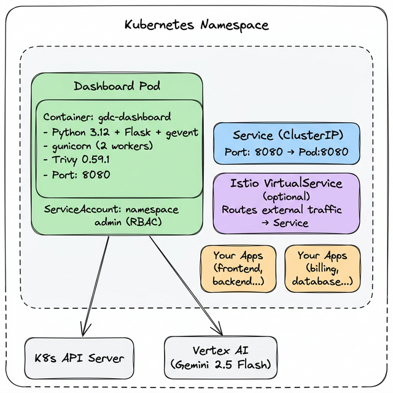
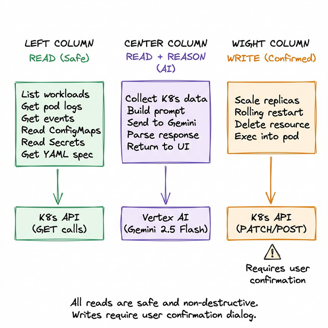

# GDC Dashboard — Application Architecture

## High-Level Architecture


---

## Component Breakdown

### 1. Frontend — `templates/index.html`

A single-page application (SPA) built with vanilla HTML, CSS, and JavaScript. No React/Vue/Angular — keeps the deployment simple and the container small.

| Component | Description |
|---|---|
| **Workloads Tab** | Tables for Deployments, StatefulSets, DaemonSets, Jobs, Pods, ConfigMaps, Secrets. Auto-refreshes every 10s. |
| **Networking Tab** | Services and Istio VirtualServices with AI analysis buttons. |
| **Security Tab** | Security audit and vulnerability scan results. |
| **AI Search Bar** | Natural language input that routes to Gemini for intent parsing. |
| **AI Chat Panel** | Multi-turn conversational agent with live K8s tool-calling. |
| **Modals** | Reusable modal system for Diagnose, Logs, Config, Optimizer, etc. |
| **Terminal (xterm.js)** | In-browser terminal connected via Socket.IO to `kubectl exec`. |
| **Toasts & Confirms** | Non-blocking notifications and confirmation dialogs for destructive actions. |

**Key Libraries (loaded via CDN):**
- `socket.io` — WebSocket communication
- `xterm.js` + `xterm-addon-fit` — terminal emulator
- `marked.js` — markdown rendering for AI responses

---

### 2. Backend — `app.py`

A Python Flask application using `flask-socketio` (gevent async mode) for both REST and WebSocket.

#### Core Infrastructure

| Component | Details |
|---|---|
| **Web Framework** | Flask + Flask-SocketIO |
| **Async Engine** | gevent (monkey-patched) |
| **K8s Client** | `kubernetes` Python SDK (auto-detects in-cluster config) |
| **AI SDK** | `google-genai` (lightweight Vertex AI client, ~2s import) |
| **Process Model** | gunicorn with gevent workers (production) |

#### API Endpoint Map

**Kubernetes Data Endpoints:**

| Endpoint | Method | Description |
|---|---|---|
| `/api/workloads` | GET | Lists all workloads (Deploy, STS, DS, Job, Pod, CM, Secret) |
| `/api/services` | GET | Lists Kubernetes Services |
| `/api/virtualservices` | GET | Lists Istio VirtualServices |
| `/api/pods/<name>/logs` | GET | Fetches pod logs |
| `/api/pods/<name>/all_logs` | GET | Fetches logs from ALL containers |
| `/api/pods/<name>/containers` | GET | Lists containers in a pod |
| `/api/pods/<name>/stats` | GET | Pod resource usage (CPU/memory) |
| `/api/workloads/env` | GET | Environment variables, ConfigMaps, Secrets |
| `/api/events/<name>` | GET | K8s events for a resource |
| `/api/yaml/<name>` | GET | Resource YAML spec |
| `/api/configmaps/<name>` | GET | ConfigMap data |
| `/api/secrets/<name>` | GET | Secret metadata (values redacted) |
| `/api/deployments/<name>/pods` | GET | Pods belonging to a deployment |

**Action Endpoints:**

| Endpoint | Method | Description |
|---|---|---|
| `/api/scale` | POST | Scale a Deployment/StatefulSet up/down |
| `/api/restart` | POST | Trigger rolling restart |
| `/api/delete` | POST | Delete a resource (with confirmation) |

**AI Endpoints (Gemini-Powered):**

| Endpoint | Method | Description |
|---|---|---|
| `/api/ai/diagnose` | POST | Unified diagnose for Deployments/StatefulSets |
| `/api/ai/diagnose_pod` | POST | Full pod diagnosis with all container logs |
| `/api/ai/analyze_workload` | POST | Workload health analysis |
| `/api/ai/health_check` | POST | Health verdict with advice |
| `/api/ai/rca` | POST | Root cause analysis for specific resources |
| `/api/ai/optimize` | GET | Resource optimization recommendations |
| `/api/ai/correlate_logs` | POST | Multi-container log correlation |
| `/api/ai/summarize_logs` | POST | AI log summarization |
| `/api/ai/explain_configmap` | POST | Explain what a ConfigMap does |
| `/api/ai/explain_resource` | POST | Explain ConfigMaps or Secrets |
| `/api/ai/describe_workload` | POST | AI-powered config analysis |
| `/api/ai/security_scan` | GET | Comprehensive security audit |
| `/api/ai/generate_yaml` | POST | Natural language → K8s YAML |
| `/api/ai/query` | POST | Natural language command interpreter |
| `/api/ai/converse` | POST | Multi-turn chat with K8s tool-calling |
| `/api/ai/converse/reset` | POST | Reset chat session |
| `/api/ai/job_insights` | POST | Job failure analysis |
| `/api/ai/health_pulse` | POST | Namespace-wide health score |
| `/api/vuln_scan` | GET | Trivy-powered CVE scan |
| `/api/vuln_scan/debug` | GET | Scan diagnostics |

**WebSocket Events (Terminal):**

| Event | Direction | Description |
|---|---|---|
| `connect_terminal` | Client → Server | Open exec session into pod container |
| `terminal_input` | Client → Server | Forward keystrokes |
| `terminal_output` | Server → Client | Stream exec output |
| `terminal_error` | Server → Client | Connection error |
| `terminal_disconnect` | Server → Client | Session closed |

---

### 3. AI Architecture — Gemini Integration

The app uses two distinct AI patterns:

#### Pattern 1: Direct Prompt (Most AI Features)


#### Pattern 2: Function Calling Agent (AI Chat / Converse)


---

### 4. Deployment Architecture



---

### 5. File Structure

```
gdc_dashboard_gemini/
├── app.py                              # Main application (5000+ lines)
│   ├── K8s data endpoints              # Workloads, Services, Pods, etc.
│   ├── Action endpoints                # Scale, Restart, Delete
│   ├── AI endpoints                    # 15+ Gemini-powered features
│   ├── Security & Vuln scan            # Trivy + Gemini audit
│   ├── Conversational agent            # Multi-turn chat with tool-calling
│   └── Terminal handlers               # Socket.IO → kubectl exec
│
├── mock_app.py                         # Mock backend for local development
│   └── Same API shape, no K8s needed   # Returns realistic fake data
│
├── templates/
│   └── index.html                      # Single-page frontend (5800+ lines)
│       ├── Tab system (Workloads, Networking, Security)
│       ├── Modal system (Diagnose, Logs, Config, Optimizer)
│       ├── AI Chat panel
│       ├── Terminal (xterm.js)
│       └── All JavaScript logic
│
├── static/
│   └── test_js.js                      # Test utilities
│
├── manifests/
│   └── deploy.yaml                     # K8s Deployment + Service + SA
│
├── Dockerfile                          # Container image (Python 3.9 + Trivy)
├── requirements.txt                    # Python dependencies
└── docs/
    ├── PROJECT-OVERVIEW.md             # This document
    └── ARCHITECTURE.md                 # You're reading it
```

---

### 6. Security Model

| Aspect | Implementation |
|---|---|
| **K8s Access** | ServiceAccount with namespace-scoped RBAC (no cluster admin) |
| **AI Access** | Workload Identity or GCP service account key for Gemini |
| **Secret Handling** | Secret values are never shown in the UI (keys only, values redacted) |
| **Destructive Actions** | Scale, restart, delete require confirmation dialog |
| **Authentication** | Relies on Istio/ingress-level auth (no built-in auth) |
| **Network** | Runs inside the cluster — no external ports exposed directly |

---

### 7. Key Dependencies

| Package | Version | Purpose |
|---|---|---|
| `flask` | 3.x | Web framework |
| `flask-socketio` | 5.x | WebSocket support for terminal |
| `gevent` | 24.x | Async engine for Socket.IO |
| `gunicorn` | 22.x | Production WSGI server |
| `kubernetes` | 31.x | Kubernetes Python client |
| `google-genai` | 1.x | Gemini AI SDK (lightweight) |
| `trivy` | 0.59.1 | Container image vulnerability scanner |

---

### 8. Data Flow Summary



All reads are safe and non-destructive. Writes (scale, restart, delete) require user confirmation.

---

### 9. AI Framework Evaluation — LangChain & LangFuse

This section documents the architectural decision around AI framework choices and observability tooling.

#### 9.1 LangChain — AI Orchestration Framework

**What it is:** LangChain is a popular framework for building LLM-powered applications. It provides abstractions for chaining LLM calls, tool/function calling, conversation memory, prompt templates, document retrieval (RAG), and agent execution loops.

**Decision: Not adopted.** The GDC Dashboard uses the `google-genai` SDK directly to call Gemini, which is the right fit for this project.

**Rationale:**

| What LangChain Provides | What GDC Dashboard Already Has |
|---|---|
| LLM integration | Direct `google-genai` SDK calling Gemini |
| Function/tool calling | Custom tool-calling agent in `/api/ai/converse` |
| Conversation memory | Multi-turn chat with session management |
| Prompt templates | Purpose-built prompt construction in each `/api/ai/*` endpoint |
| Agent loop | Custom agentic loop in the converse endpoint |

**Why direct SDK is preferred here:**

- **Lower overhead** — `google-genai` is lightweight (~2s import) vs. LangChain's heavier dependency tree
- **Full control** — Prompts, tool definitions, and response handling are explicitly managed with no hidden abstractions
- **Simpler debugging** — Fewer layers to trace through when diagnosing AI behavior
- **Lighter container** — The Docker image stays lean without transitive LangChain dependencies
- **No abstraction mismatch** — LangChain's generic patterns can obscure Gemini-specific capabilities (e.g., native function calling, safety settings)

**When LangChain would make sense:**

- Rapid prototyping where time-to-first-demo matters more than control
- Multi-model orchestration (e.g., chaining Gemini + Claude + GPT)
- Complex RAG pipelines with document loaders, vector stores, and retrievers
- Applications that need to switch LLM providers frequently

#### 9.2 LangFuse — LLM Observability & Tracing

**What it is:** LangFuse is an open-source observability platform purpose-built for LLM applications. It provides tracing, cost tracking, prompt management, session grouping, quality scoring, and evaluation capabilities — similar to Datadog/New Relic but specifically for AI calls.

**Decision: Not adopted yet — recommended for production deployment.**

**What LangFuse would provide for GDC Dashboard:**

| Capability | Value for This Project |
|---|---|
| **Trace every LLM call** | Input prompt, output, latency, token count across all 15+ AI endpoints |
| **Session grouping** | Track multi-turn `/api/ai/converse` conversations end-to-end |
| **Cost tracking** | Monitor Gemini API spend per feature (diagnose, RCA, security scan, etc.) |
| **Quality scoring** | Measure whether AI responses are accurate and actionable |
| **Prompt versioning** | A/B test prompt changes without redeploying |
| **Failure detection** | Surface AI calls that timeout, hallucinate, or return poor results |

**Adoption guidance by deployment stage:**

| Stage | Recommendation |
|---|---|
| Local development / demo | ❌ Not needed — adds unnecessary complexity |
| Internal tool for a small team | ⚠️ Nice to have — helps track costs and catch bad outputs |
| Production with real users | ✅ Strongly recommended — essential for reliability and cost management |
| Optimizing AI response quality | ✅ Yes — trace and evaluate outputs systematically |

**Integration path (when ready):**

LangFuse integrates with the `google-genai` SDK via a lightweight decorator pattern — no need to adopt LangChain. The integration would add tracing to existing endpoints without changing the core architecture:

```python
# Example: Adding LangFuse tracing to an existing AI endpoint
from langfuse.decorators import observe

@observe(name="diagnose_pod")
def diagnose_pod(pod_name):
    # Existing Gemini call — unchanged
    response = client.models.generate_content(
        model="gemini-2.0-flash",
        contents=prompt
    )
    return response.text
```

#### 9.3 Summary

```
┌─────────────────────────────────────────────────────────┐
│                  AI Architecture Decision                │
├─────────────────────────┬───────────────────────────────┤
│  LangChain              │  ❌ Not adopted               │
│  (AI Orchestration)     │  Direct google-genai SDK      │
│                         │  provides full control with   │
│                         │  less overhead                │
├─────────────────────────┼───────────────────────────────┤
│  LangFuse               │  ⚠️ Deferred                  │
│  (AI Observability)     │  Recommended when moving to   │
│                         │  production — integrates      │
│                         │  without architectural change │
└─────────────────────────┴───────────────────────────────┘
```
