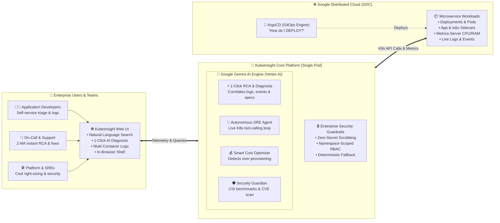

# 🚀 Project Spotlight: KubeInsight — Transforming Kubernetes Operations with Google Gemini AI

*Empowering developers, accelerating incident resolution, and bringing intelligent Day-2 operations to Google Distributed Cloud (GDC).*

---

## 📌 Executive Summary

As our organization migrates workloads to **Google Distributed Cloud (GDC)**, our engineering team has developed **KubeInsight**, an intelligent operations platform powered by **Google Gemini AI**. 

KubeInsight transforms Day-2 Kubernetes operations from a complex, CLI-driven chore into an intuitive, self-service experience. By embedding Google Gemini directly into cluster management workflows, KubeInsight acts as an **on-demand virtual SRE** that diagnoses failing microservices, uncovers root causes, right-sizes cloud infrastructure, and enforces proactive security guardrails in real time.

---

## 🔍 The Challenge: Bridging the Operations Gap

While GitOps tools such as ArgoCD excel at automated deployment pipelines (syncing code from Git into the cluster), they do not address **Day-2 operations**—the continuous monitoring, troubleshooting, and health maintenance of running microservices.

Historically, when an application pod encountered issues (e.g., `CrashLoopBackOff`, memory exhaustion, or network timeouts):
* Engineers had to manually construct 10–15 complex `kubectl` commands.
* On-call personnel parsed hundreds of raw log lines and event logs across multiple containers and sidecars.
* Standard incident triage frequently consumed **20 to 45 minutes** per occurrence.
* Debugging required specialized senior SRE knowledge, creating an operational bottleneck where developers had to escalate routine container issues.

---

## 💡 The Solution: Intelligent Operations with Google Gemini

**KubeInsight** bridges this gap by unifying cluster observation and Google Gemini's reasoning capabilities within a single browser-based dashboard:

> *"ArgoCD deploys our applications. KubeInsight keeps them running reliably, cost-effectively, and securely."*

Rather than presenting static tables and walls of text, KubeInsight contextually gathers live cluster telemetry (container logs, Kubernetes events, resource metrics, and pod specifications) and leverages Gemini to produce instant, structured, and actionable diagnoses.

---

## 🌟 Key Highlights & Business Value

### 1. ⚡ 85%+ Reduction in Incident Triage Time (MTTR)
* **One-Click AI Diagnose & Root Cause Analysis (RCA):** Instead of manually combing through log streams, engineers click a single button to trigger full-stack diagnostics.
* **Intelligent Cross-Container Correlation:** Gemini detects intricate failure chains—such as an Istio sidecar proxy timeout precipitating an application database disconnect—in seconds, complete with recommended `kubectl` remediations.

### 2. 👥 Democratizing Kubernetes Operations
* **Natural Language Search Bar:** Developers can search and operate their clusters using everyday language (e.g., *"Show me crashing pods"*, *"Why is billing-service failing?"*, or *"Scale backend to 3 replicas"*).
* **Self-Service Autonomy:** Development teams can independently resolve **~70% of routine workload failures** without opening tickets with the infrastructure team.

### 3. 💰 Continuous Cloud Cost Optimization
* **Smart Resource Optimizer:** Continuously contrasts real-time CPU/memory utilization against allocated limits.
* **Elimination of Waste:** Flags over-provisioned workloads and inactive "zombie" resources, providing specific right-sizing recommendations that yield direct infrastructure savings.

### 4. 🛡️ Proactive Security & Compliance
* **Automated Security Guard:** Evaluates running workloads against CIS Kubernetes benchmarks and security best practices.
* **Early Risk Detection:** Automatically identifies root-privileged containers, missing network policies, over-permissive service accounts, and image vulnerabilities (via integrated CVE scanning) before production is impacted.

---

## 📐 Conceptual Architecture & Flow

The platform's operational flow connects our engineering teams, the Gemini AI engine, and our GDC workloads seamlessly:

* 🎨 **Editable Excalidraw Diagram:** [kubeinsight-conceptual-architecture.excalidraw](file:///Users/rajeshe/.gemini/antigravity/scratch/mock-project-gemini/docs/diagrams/kubeinsight-conceptual-architecture.excalidraw)  
  *(Can be imported directly into [excalidraw.com](https://excalidraw.com), VSCode Excalidraw extension, or Obsidian).*

---

## 📊 Business Impact by the Numbers

| Operational Dimension | Traditional Operations (`kubectl` / Raw Logs) | With KubeInsight (Gemini AI) | Measured Business Benefit |
| :--- | :--- | :--- | :--- |
| **Incident Triage Time (MTTR)** | 20 – 40 minutes per incident | **Under 2 minutes** | **~85% faster resolution** |
| **Developer Self-Service** | 0% (Escalated to DevOps/SRE) | **~70% resolved autonomously** | Removes SRE bottlenecks |
| **Resource Right-Sizing** | Infrequent manual quarterly reviews | **Continuous, real-time optimization** | Direct cloud spend savings |
| **Security Audit Frequency** | Periodic manual checks | **Continuous one-click compliance** | Proactive risk mitigation |
| **Developer Onboarding** | Weeks to master `kubectl` syntax | **Day 1 productivity via AI search** | Near-zero ramp-up time |

---

## 🔒 Enterprise-Grade Architecture & Security

KubeInsight was engineered with strict adherence to enterprise security and cloud governance:

* **Zero-Secret Exposure:** Sensitive credential values and secrets are programmatically scrubbed prior to any AI prompt generation. Only metadata and structural keys are processed.
* **Namespace-Scoped RBAC:** The platform requires only standard namespace-level permissions—no cluster-admin privileges or elevated cluster scopes needed.
* **High Efficiency & Low Footprint:** Deployed as a lightweight single pod (~200MB container) via existing ArgoCD pipelines. Consumes Google Gemini 2.5 Flash via managed Vertex AI APIs (~$3–$5/month per team), eliminating custom ML infrastructure or GPU hosting costs.
* **Deterministic Graceful Degradation:** If external AI services are unreachable, the platform automatically falls back to deterministic, rule-based heuristics, ensuring zero downtime for core monitoring functions.

---

## 🗺️ Strategic Roadmap

* **Collaborative AI Agent (MCP):** Implementation of the Model Context Protocol to allow centralized AI assistants to query cluster health safely.
* **Proactive ChatOps Integration:** Instant alerting and remediation workflows delivered directly to enterprise messaging channels (Microsoft Teams / Slack).
* **Cross-Cluster Fleet Analytics:** Multi-namespace aggregations to provide executive leadership with a consolidated posture of overall organization health and efficiency.

---

## 📢 Ready-to-Publish Executive Blurb (30-Second Digest)

> **Spotlight: KubeInsight — AI-Driven Day-2 Kubernetes Operations**
>
> As our organization accelerates migration to **Google Distributed Cloud (GDC)**, our engineering team has introduced **KubeInsight**, an intelligent operations platform powered by **Google Gemini AI**.
>
> **Why It Matters:**
> * **Slashes MTTR by ~85%:** Accelerates incident diagnosis from 30+ minutes down to seconds through one-click automated root cause analysis.
> * **Empowers Application Teams:** Natural language search allows developers to troubleshoot and inspect services without needing specialized command-line expertise.
> * **Optimizes Cloud Spend:** Continuously identifies over-provisioned CPU and memory to reduce compute waste.
> * **Built Securely:** Operates within namespace boundaries, strictly protects sensitive credentials, and deploys as a lightweight single container with minimal operational cost (~$3–$5/month per team).
>
> *KubeInsight demonstrates how practical AI can be harnessed to increase system resilience, reduce toil, and elevate developer velocity across our cloud modernization journey.*

---

*For inquiries, feedback, or to onboard your team's namespace, contact the Cloud & DevOps Platform Team.*
