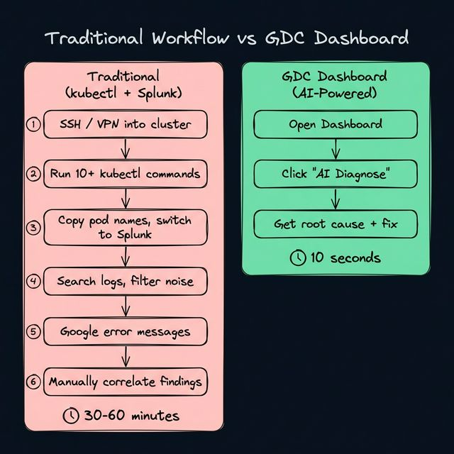
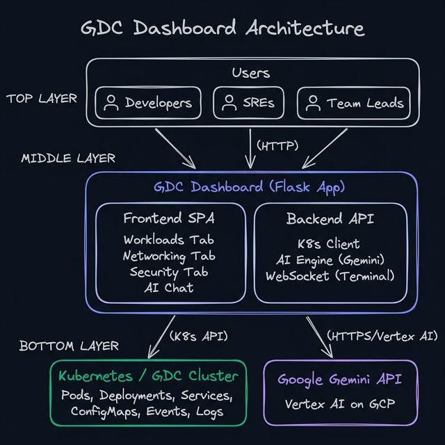
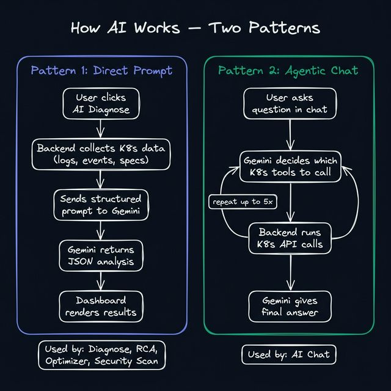
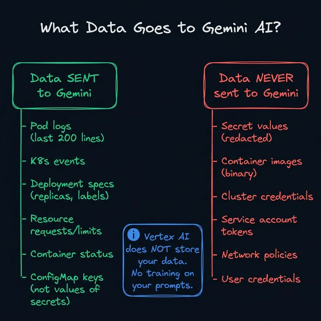
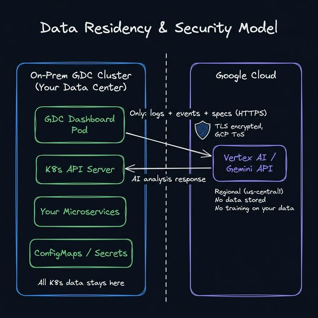

# GDC Dashboard — Demo Presentation Guide

> *For the team demo — explains the project in simple terms with enough technical depth for developers and leads.*

---

## Why Did We Build This?

### The Problem

When a pod crashes in production, here's what a typical engineer does today:

**The traditional way takes 30–60 minutes:**
1. VPN/SSH into the cluster
2. Run `kubectl get pods`, find the broken pod
3. Run `kubectl describe pod ...`, read the events
4. Run `kubectl logs ...`, scroll through 500+ lines
5. Switch to Splunk, paste the pod name, search for logs
6. Filter noise, find the relevant error
7. Google the error message
8. Manually piece together what happened

**With GDC Dashboard — 10 seconds:**
1. Open the dashboard
2. Click **AI Diagnose**
3. Get the root cause, risk list, and exact kubectl fix

That's the core value: **reducing MTTR (Mean Time To Resolve) from 30+ minutes to under a minute.**

---

## What Is It?

A **real-time Kubernetes operations dashboard** running on GDC, enhanced with **Google Gemini AI**. It gives your team a single pane of glass to monitor, troubleshoot, and manage workloads.

> **Think of it this way: ArgoCD deploys your apps. This dashboard keeps them running.**

---

## Architecture

### In Simple Terms

- **Frontend** — A single-page web app (HTML/CSS/JS). No React, no Angular — keeps the container small and simple.
- **Backend** — Python Flask app that talks to two things:
  - **Kubernetes API** — reads pod status, logs, events, configs
  - **Gemini API** — sends K8s data for AI analysis

### Deployment

- Runs as a **single pod** in your namespace (same as any app ArgoCD deploys)
- Needs **namespace-level RBAC** only (no cluster admin)
- Container size: ~200MB

---

## Key Features at a Glance

| Feature | What It Does | Who Benefits |
|---------|-------------|-------------|
| **Workloads Dashboard** | Real-time view of all Deployments, Pods, Jobs, ConfigMaps, Secrets | Everyone |
| **AI Diagnose** | One-click health analysis with root cause + fix | Developers, SREs |
| **AI Root Cause Analysis** | Deep investigation report for failing workloads | On-call engineers |
| **AI Log Analysis** | Summarizes 500 log lines into key findings | Everyone |
| **Multi-Container Log Correlation** | Correlates logs across sidecars, init containers, app containers | SREs |
| **AI Resource Optimizer** | Shows CPU/memory waste and cost savings | Team Leads, Finance |
| **Natural Language Search** | Type "show crashing pods" or "scale frontend to 3" | Everyone |
| **AI Chat (Conversational)** | Ask questions about your cluster in plain English | Everyone |
| **Security Audit** | Scans for privileged containers, missing network policies, etc. | Security team |
| **CVE Vulnerability Scan** | Trivy-based image scanning for known CVEs | Security team |
| **Config Explainer** | Explains what each ConfigMap/Secret key does | Developers |
| **Pod Terminal** | In-browser terminal into running containers | SREs |
| **Scale / Restart / Delete** | One-click actions with confirmation dialogs | SREs, Developers |

---

## How AI Is Integrated

We use **Google Gemini** (specifically `gemini-2.5-flash`) through the **Vertex AI API**. There are two patterns:

### Pattern 1: Direct Prompt (used by most features)

1. User clicks an AI button (e.g., "Diagnose")
2. The backend collects **live K8s data** — logs, events, pod specs, resource usage
3. Everything is packaged into a **structured prompt** that asks Gemini a specific question
4. Gemini returns a **structured JSON response** (e.g., health score, risks, fixes)
5. The dashboard renders it beautifully

**Used by:** Diagnose, RCA, Log Analysis, Optimizer, Security Audit, Config Explainer, YAML Generator

### Pattern 2: Agentic Chat (AI Chat feature)

1. User types a question: *"Why is billing-service slow?"*
2. The question goes to Gemini **along with a list of 10 K8s tools** it can call
3. Gemini **decides autonomously** which tools to use — e.g., "let me list pods, then get logs"
4. The backend **executes the real K8s API calls** and returns results to Gemini
5. Gemini can loop up to **5 times** — investigating like a real SRE
6. Finally, Gemini delivers its answer based on real, live data

**Key point:** In Pattern 1, we decide what data to fetch. In Pattern 2, **the AI decides** — making it capable of answering questions we didn't anticipate.

---

## Comparison: GDC Dashboard vs. ArgoCD vs. kubectl + Splunk

| Scenario | kubectl + Splunk | ArgoCD | GDC Dashboard |
|----------|-----------------|--------|---------------|
| Deploy a new version | ❌ | ✅ GitOps sync | ❌ Not its job |
| Why is my pod crashing? | Manual: 10+ commands + Splunk search | ❌ Just shows ❌ status | ✅ **AI Diagnose** — instant RCA |
| Read logs from all containers | `kubectl logs -c` × each container | ❌ Not available | ✅ One-click + AI correlation |
| Find CVEs in images | External tool needed | ❌ No scanning | ✅ Built-in Trivy scan |
| Are we over-provisioned? | Manual resource analysis | ❌ No visibility | ✅ **AI Optimizer** with cost estimate |
| Scale to 5 replicas | `kubectl scale ...` | Git commit + sync | ✅ One click |
| What does this ConfigMap do? | Read YAML manually | ❌ | ✅ **AI Explain** |
| Natural language questions | ❌ | ❌ | ✅ "Show me crashing pods" |
| Terminal into a pod | `kubectl exec` (needs CLI access) | ❌ | ✅ In-browser terminal |

### The Bottom Line

| Tool | Role |
|------|------|
| **ArgoCD** | *"How do I DEPLOY my app?"* — CI/CD pipeline |
| **kubectl + Splunk** | *"Low-level cluster access + log search"* — manual operations |
| **GDC Dashboard** | *"How do I OPERATE my app?"* — AI-assisted Day-2 operations |

They are **complementary, not competing.** ArgoCD deploys. The dashboard operates.

---

## Pros and Cons

### ✅ Pros

| Advantage | Details |
|-----------|---------|
| **Massive time savings** | AI diagnose/RCA in seconds vs. 30+ min manual investigation |
| **No kubectl knowledge needed** | Developers can troubleshoot without learning CLI |
| **AI-powered insights** | Gemini finds patterns humans miss (cross-container correlation, optimization) |
| **Single pane of glass** | Workloads, logs, configs, security — all in one place |
| **No external DB** | Uses K8s ConfigMaps and in-memory state — zero infrastructure to manage |
| **Lightweight** | Single pod, ~200MB image, namespace-scoped |
| **Graceful degradation** | Every AI feature has a fallback — works without Gemini too |
| **Low cost** | Gemini Flash: ~$0.001 per AI call, ~$3–5/month at heavy usage |

### ⚠️ Cons / Limitations

| Limitation | Mitigation |
|-----------|------------|
| **Data leaves the cluster for AI** | Only logs/events/specs sent; secrets redacted; Vertex AI doesn't store data |
| **Depends on Gemini availability** | Fallback mode built into every feature |
| **Single namespace view** | By design — each team deploys their own instance |
| **No built-in auth** | Relies on Istio/Ingress-level authentication |
| **Not a replacement for monitoring** | Complements Prometheus/Grafana; doesn't collect metrics over time |

---

## AI Logs vs. Splunk Logs

| Aspect | Splunk | GDC Dashboard AI Logs |
|--------|--------|----------------------|
| **Access** | Separate tool, requires login, build queries | Built into dashboard, one click |
| **Search** | Manual query syntax (SPL), filter by fields | AI understands natural language: "show errors from last 5 min" |
| **Analysis** | You read 500 lines and find the pattern | AI reads 500 lines and **tells you** the pattern |
| **Cross-container** | Manual — search each container separately | AI correlates all containers at once (sidecar → app → init) |
| **Root cause** | You manually connect the dots | AI connects the dots and gives the fix |
| **Historical data** | ✅ Weeks/months of retention | ❌ Live logs only (current pod) |
| **Alerting** | ✅ Alert rules on patterns | ❌ No built-in alerting |

**Key takeaway:** Splunk is for **historical log storage and querying**. GDC Dashboard AI is for **real-time incident response**. Best used together — when GDC AI says "the error started at 14:03", you go to Splunk to look at what happened before 14:03.

---

## Data Safety & Security

### What Data Goes to Gemini?

### Data Residency Concern

### The Full Picture

| Question | Answer |
|----------|--------|
| **Does data leave the GDC cluster?** | **Yes** — when AI features are triggered, K8s data (logs, events, specs) is sent to Vertex AI via HTTPS |
| **Does Google store our data?** | **No** — Vertex AI does not store prompts or responses. Not used for training. |
| **What region is it processed in?** | Configurable: `GCP_REGION=us-central1` (or whatever your org chooses) |
| **Are secrets sent?** | **No** — secret values are always redacted. Only key names are referenced. |
| **Is the connection encrypted?** | **Yes** — TLS 1.2+ over HTTPS. Covered by GCP Terms of Service. |
| **Can the AI modify the cluster?** | **No** — AI Chat tools are **read-only**. Scale/restart/delete are separate, human-controlled actions. |
| **What if our policy forbids external API calls?** | The dashboard works without AI — all features have fallback mode. AI can be disabled entirely with no env vars. |

### Threat Model

| Threat | Risk | Mitigation |
|--------|------|------------|
| **Log data contains sensitive info** (passwords in debug output, PII) | Medium | Logs are truncated (last 200 lines), secrets are redacted, consider adding a log sanitizer |
| **Network interception** | Low | TLS-encrypted, within GCP backbone when using Workload Identity |
| **Gemini hallucination** (wrong diagnosis) | Low-Medium | Structured prompts with real data minimize hallucination; all AI output includes the source data for human verification |
| **Unauthorized access to AI features** | Medium | Rely on Istio/Ingress auth; no built-in AuthN; recommend adding RBAC layer |
| **Token cost explosion** | Low | Gemini Flash is cheap (~$0.001/call); add AI metrics tracking (Initiative 1) |
| **AI Chat executes dangerous actions** | **Zero** | Chat tools are strictly read-only. Mutations require a separate confirmation flow. |

### Recommendations for Data-Sensitive Teams

1. **Enable Vertex AI data residency** — configure regional processing to match your compliance requirements
2. **Add a log sanitizer** — strip PII/passwords from logs before sending to Gemini
3. **Use Workload Identity** — avoids storing service account keys in the pod
4. **Audit AI usage** — implement AI Metrics (Initiative 1) to track every Gemini call
5. **Consider VPC-SC** — Vertex AI supports VPC Service Controls for network isolation

---

## Tech Stack Summary

| Component | Technology | Why |
|-----------|-----------|-----|
| **Backend** | Python Flask + gevent | Lightweight, async-capable, easy to deploy |
| **Frontend** | Vanilla HTML/CSS/JS | No build step, small image, fast load |
| **AI** | Google Gemini 2.5 Flash via Vertex AI | Fast, cheap, good at structured output |
| **K8s Client** | `kubernetes` Python SDK | Official client, auto-detects in-cluster config |
| **Terminal** | xterm.js + Socket.IO | In-browser terminal, real-time |
| **CVE Scanner** | Trivy | Industry-standard, embedded in the container |
| **Deployment** | Single pod + Service + ServiceAccount | Minimal footprint, ArgoCD-deployable |

---

*Document prepared for demo presentation. For deeper technical details, see [ARCHITECTURE.md](ARCHITECTURE.md) and [GEMINI-AI-FEATURES.md](GEMINI-AI-FEATURES.md).*
