# Gemini AI Features — How It All Works

> **Purpose:** This document explains every Gemini-integrated feature in the dashboard — in plain language for stakeholders and technically for engineering teams. Use it for presentations, demos, and Q&A.

---

## Table of Contents

1. [How Gemini Connects to the Dashboard](#1-how-gemini-connects-to-the-dashboard)
2. [The Two AI Patterns We Use](#2-the-two-ai-patterns-we-use)
3. [Feature Deep-Dives](#3-feature-deep-dives)
   - [AI Diagnose](#31-ai-diagnose)
   - [AI Root Cause Analysis (RCA)](#32-ai-root-cause-analysis-rca)
   - [AI Log Analysis & Multi-Container Log Correlation](#33-ai-log-analysis--multi-container-log-correlation)
   - [AI Resource Optimizer](#34-ai-resource-optimizer)
   - [Conversational AI Agent (Chat)](#35-conversational-ai-agent-chat)
   - [Natural Language Search (Ask AI)](#36-natural-language-search-ask-ai)
   - [AI Config Explainer](#37-ai-config-explainer)
   - [Security Audit (AI-Powered)](#38-security-audit-ai-powered)
   - [AI Self-Heal](#39-ai-self-heal)
   - [YAML Generation](#310-yaml-generation)
   - [Networking AI (Service & VirtualService Analysis)](#311-networking-ai)
   - [Health Pulse (Namespace-Wide)](#312-health-pulse)
   - [Job Insights](#313-job-insights)
4. [Fallback Behavior (No Gemini)](#4-fallback-behavior)
5. [Common Questions](#5-common-questions)

---

## 1. How Gemini Connects to the Dashboard

### Plain Language
The dashboard talks to Google's Gemini AI through a secure API. When you click an AI button, the dashboard collects relevant data from Kubernetes (logs, events, pod specs), sends it to Gemini with a specific question, and displays the AI's structured answer — all in 2-5 seconds.

### Technical Details

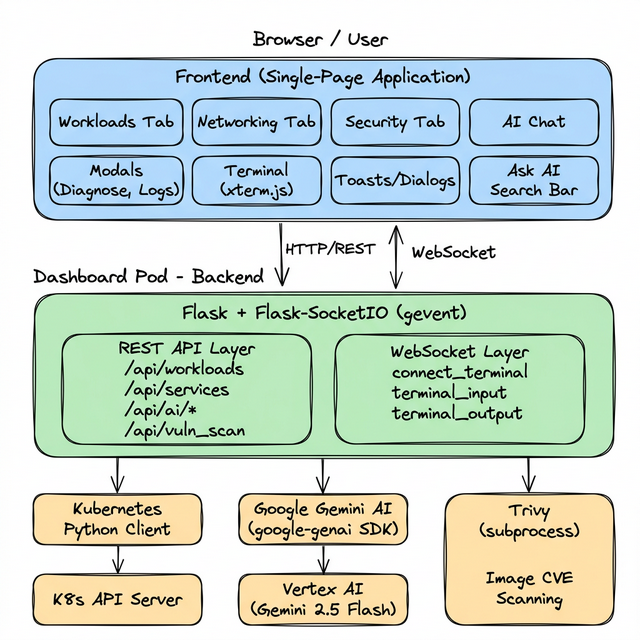

| Component | Detail |
|---|---|
| **SDK** | `google-genai` (lightweight Python SDK, ~2s import time) |
| **Model** | `gemini-2.5-flash` — fast, cost-efficient, optimized for structured output |
| **Auth** | GCP Service Account key (`GOOGLE_APPLICATION_CREDENTIALS`) or Workload Identity |
| **Init** | Thread-safe lazy initialization with double-checked locking + background pre-warm |
| **Fallback** | If Gemini is unavailable, every feature has a deterministic (non-AI) fallback |

**Required Environment Variables:**
```bash
GOOGLE_APPLICATION_CREDENTIALS=/path/to/sa-key.json
GCP_PROJECT_ID=your-gcp-project
GCP_REGION=us-central1
```

**How SDK initialization works:**
1. On startup, a background thread pre-warms the Gemini client (so the first user request isn't slow)
2. The client uses double-checked locking — thread-safe even under concurrent requests
3. If initialization fails, a `_client_error` variable stores the reason, visible at `/api/ai/status`
4. All AI features check `get_model()` before calling Gemini — if it returns `None`, the feature falls back to deterministic logic

---

## 2. The Two AI Patterns We Use

Every AI feature in the dashboard uses one of two patterns:

### Pattern 1: Direct Prompt (used by most features)

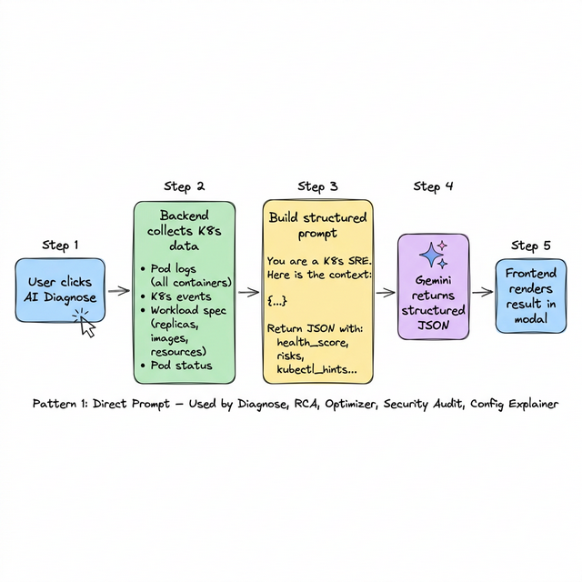

**How it works:**
1. User triggers an AI action (e.g., clicks "Diagnose")
2. Backend **collects live Kubernetes data** — pod logs, events, workload specs, resource usage
3. Backend **builds a structured prompt** with the K8s data embedded, asking for a specific JSON schema
4. Gemini analyzes the data and returns **structured JSON** (not free-form text)
5. Frontend renders each field of the JSON into the appropriate UI component

**Why structured JSON?** The UI needs to know which parts are "risks" (red), "positive signals" (green), "kubectl hints" (code blocks), etc. Structured output makes the frontend rendering clean and consistent.

**Features using this pattern:** AI Diagnose, RCA, Log Analysis, Resource Optimizer, Config Explainer, Security Audit, Self-Heal, YAML Generation, Health Pulse, Job Insights, Networking AI

---

### Pattern 2: Agentic Function Calling (AI Chat / Converse)

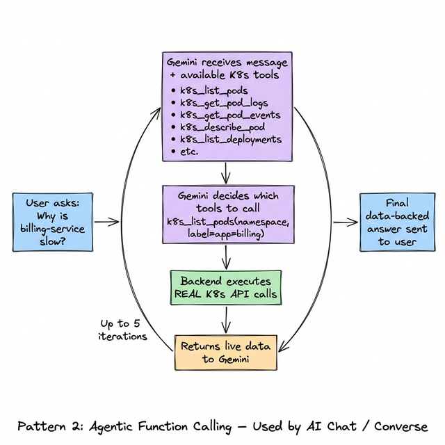

**How it works:**
1. User types a question in the AI Chat panel
2. The backend sends the question to Gemini **along with a list of available K8s tools** (functions Gemini can call)
3. Gemini **decides autonomously** which tools to call (e.g., "list pods", "get logs for pod X")
4. The backend **executes the real K8s API calls** and returns the results to Gemini
5. Gemini **reasons over the real data** and either calls more tools or gives a final answer
6. This loop runs for **up to 5 iterations** — so Gemini can investigate multi-step problems

**Available K8s Tools (what Gemini can call):**

| Tool | What It Does |
|---|---|
| `k8s_list_pods` | List all pods in a namespace with status |
| `k8s_get_pod_logs` | Get logs from a specific pod |
| `k8s_get_pod_events` | Get K8s events for a pod |
| `k8s_describe_pod` | Get full pod spec + status |
| `k8s_list_deployments` | List deployments with replica counts |
| `k8s_get_deployment_status` | Detailed deployment status |
| `k8s_list_services` | List services with ports |
| `k8s_get_configmap` | Read ConfigMap data |
| `k8s_get_namespace_events` | All events in the namespace |
| `k8s_list_statefulsets` | List statefulsets |

**Key difference from Pattern 1:** In Pattern 1, the backend decides what data to collect. In Pattern 2, **Gemini decides** what data it needs — making it capable of investigating ad-hoc questions the developer didn't anticipate.

**Session management:** Chat history is maintained per-session (via `X-Session-Id` header), trimmed to 30 turns to avoid token overflow.

---

## 3. Feature Deep-Dives

### 3.1 AI Diagnose

**What it does (plain language):**
Click "Diagnose" on any Deployment, StatefulSet, or DaemonSet, and the AI instantly tells you: Is it healthy? What's wrong? How do I fix it? — with a health score, risk list, and exact kubectl commands.

**How it works technically:**

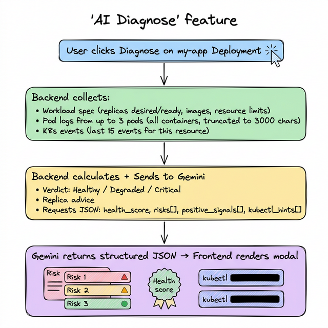

**API:** `POST /api/ai/diagnose`
**Pattern:** Direct Prompt

---

### 3.2 AI Root Cause Analysis (RCA)

**What it does (plain language):**
When something is broken, RCA goes deeper than Diagnose. It reads logs from ALL containers (init, sidecar, app), correlates Kubernetes events, and produces a structured investigation report: what broke, supporting evidence (exact log lines), impact assessment, numbered fix steps, and prevention recommendations.

**How it works technically:**

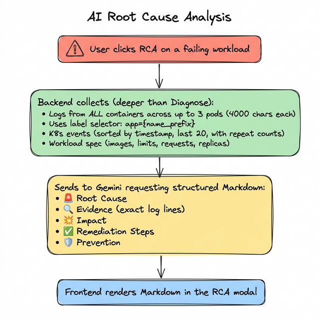

**Key difference from Diagnose:** Diagnose gives a health snapshot (structured JSON). RCA gives an investigation narrative (structured Markdown) — more detail, more evidence, more actionable.

**API:** `POST /api/ai/rca`
**Pattern:** Direct Prompt

---

### 3.3 AI Log Analysis & Multi-Container Log Correlation

**What they do (plain language):**

- **Log Summarization:** Paste or fetch hundreds of log lines → AI summarizes them into: key errors, patterns, warnings, and what to do about them.
- **Multi-Container Correlation:** For pods with sidecars (e.g., Istio envoy + app container), the AI reads logs from ALL containers simultaneously and finds causal chains — "the sidecar connection pool exhausted at 14:03, causing the app's database calls to fail at 14:04."

**How Log Summarization works:**

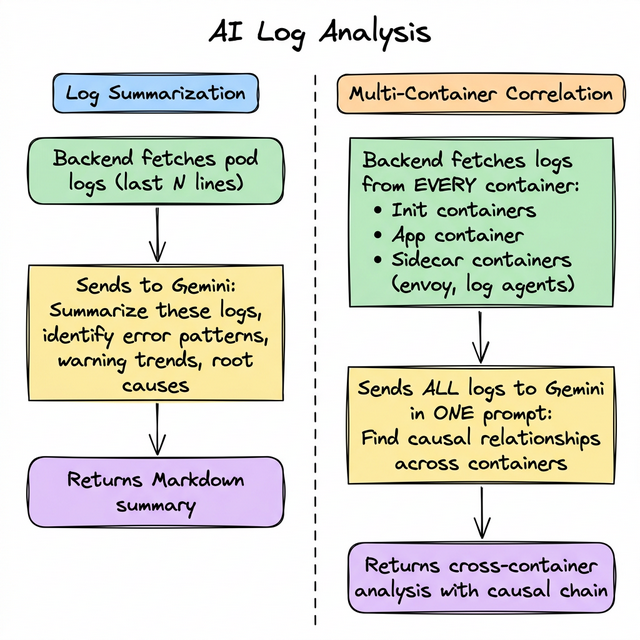

**APIs:** `POST /api/ai/summarize_logs`, `POST /api/ai/correlate_logs`
**Pattern:** Direct Prompt

---

### 3.4 AI Resource Optimizer

**What it does (plain language):**
Scans all workloads in your namespace, compares their actual CPU/memory usage against configured limits, and calculates: how much you're overspending, what the right-sized values should be, and the estimated monthly savings. Shows per-workload cost breakdowns.

**How it works technically:**

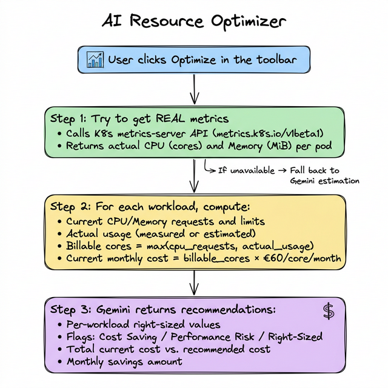

**Cost model:** €60 EUR per CPU core per month (configurable per org). Memory is tracked for OOM risk but not separately billed.

**API:** `GET /api/ai/optimize`
**Pattern:** Direct Prompt (with metrics-server data)

---

### 3.5 Conversational AI Agent (Chat)

**What it does (plain language):**
A ChatGPT-like panel where you can ask questions about your cluster in plain English. Unlike ChatGPT, this agent has **live access to your Kubernetes cluster** — it can list pods, read logs, check events, and inspect configs in real-time. You can have multi-turn conversations.

**Example conversation:**
```
You:    "Why is billing-service slow?"
Agent:  [Calls k8s_list_pods to find billing pods]
        [Calls k8s_get_pod_logs for billing-service-abc123]
        [Calls k8s_get_pod_events for billing-service-abc123]
Agent:  "billing-service-abc123 shows connection pool exhaustion 
         to the database. The logs show 47 timeout errors in the 
         last 5 minutes. The pod's CPU is at 95% of its limit 
         (200m). Recommend increasing CPU limit to 500m and 
         checking database connection pool size."

You:    "How many replicas does it have?"
Agent:  [Calls k8s_get_deployment_status for billing-service]
Agent:  "billing-service has 2/3 replicas ready. One pod is in 
         CrashLoopBackOff. Here's the crash log..."
```

**How it works technically:**
- Uses Gemini's **Function Calling** feature — Gemini autonomously decides which K8s API calls to make
- 10 pre-defined K8s tools registered with Gemini (list pods, get logs, etc.)
- Up to 5 round-trips per question (tool call → result → tool call → result → final answer)
- Conversation history maintained per browser session (trimmed to 30 turns)
- Temperature set to 0.2 (low creativity, high accuracy)

**API:** `POST /api/ai/converse`
**Pattern:** Agentic Function Calling

---

### 3.6 Natural Language Search (Ask AI)

**What it does (plain language):**
Type natural language into the search bar — "show me crashing pods", "scale frontend to 3 replicas", "restart billing-service" — and the AI understands your intent and executes the action directly in the dashboard.

**How it works technically:**

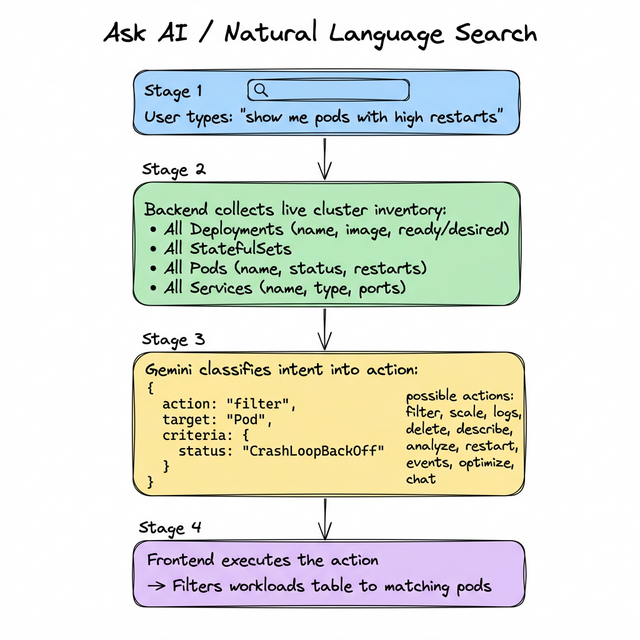

**Supported actions:** filter workloads, scale replicas, show logs, delete resources, describe/analyze workloads, restart, show events, vulnerability scan, resource optimization, and conversational chat fallback.

**API:** `POST /api/ai/query`
**Pattern:** Direct Prompt (with full cluster context)

---

### 3.7 AI Config Explainer

**What it does (plain language):**
Select any ConfigMap, Secret, or workload → AI explains in plain English what each configuration key does, flags sensitive values that should be in Secrets, and recommends improvements.

**How it works technically:**

Two endpoints serve this feature:

1. **Describe Workload** (`/api/ai/describe_workload`): Takes all env vars, ConfigMap refs, and Secret refs for a workload → Gemini returns:
   - Plain-English summary of what the workload is configured to do
   - Security flags (severity: high/medium/low) — e.g., "DB_PASSWORD is hardcoded, not from a Secret"
   - Actionable recommendations
   - Specific kubectl commands for this workload

2. **Explain ConfigMap** (`/api/ai/explain_configmap`): Reads ConfigMap data → Gemini explains each key's purpose, flags sensitive data, and suggests improvements.

3. **Explain Resource** (`/api/ai/explain_resource`): Unified endpoint for both ConfigMaps and Secrets.

**API:** `POST /api/ai/describe_workload`, `GET /api/ai/explain_configmap`, `POST /api/ai/explain_resource`
**Pattern:** Direct Prompt

---

### 3.8 Security Audit (AI-Powered)

**What it does (plain language):**
One click scans ALL workloads in your namespace for security risks: privileged containers, missing network policies, over-permissive RBAC, host path mounts, missing security contexts, unpinned image tags — then Gemini ranks every finding by severity with CIS Kubernetes Benchmark references.

**How it works technically:**

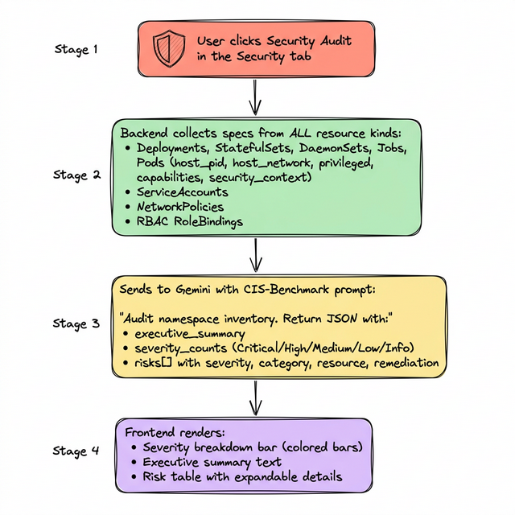

**Risk categories:** Pod Security, RBAC, Network Policies, Container Security, Image Security, Resource Management

**API:** `GET /api/ai/security_scan`
**Pattern:** Direct Prompt (with full namespace inventory)

---

### 3.9 AI Self-Heal

**What it does (plain language):**
When a workload is failing (CrashLoopBackOff, OOMKilled, ImagePullBackOff), Self-Heal doesn't just diagnose — it **proposes a specific fix action** with a one-click "Apply" button. For example: "OOMKilled → Increase memory limit to 512Mi" with the exact kubectl command pre-generated.

**How it works technically:**

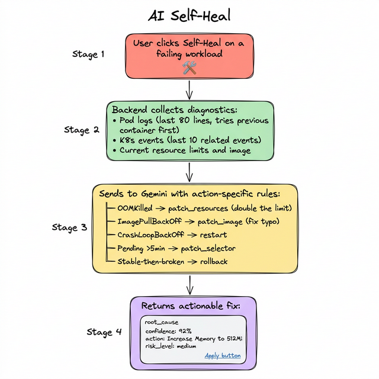

**API:** `POST /api/ai/self_heal`
**Pattern:** Direct Prompt

---

### 3.10 YAML Generation

**What it does (plain language):**
Describe what you need in English — "create a Redis deployment with 2 replicas and 256Mi memory" — and the AI generates production-ready Kubernetes YAML with security best practices baked in.

**How it works technically:**

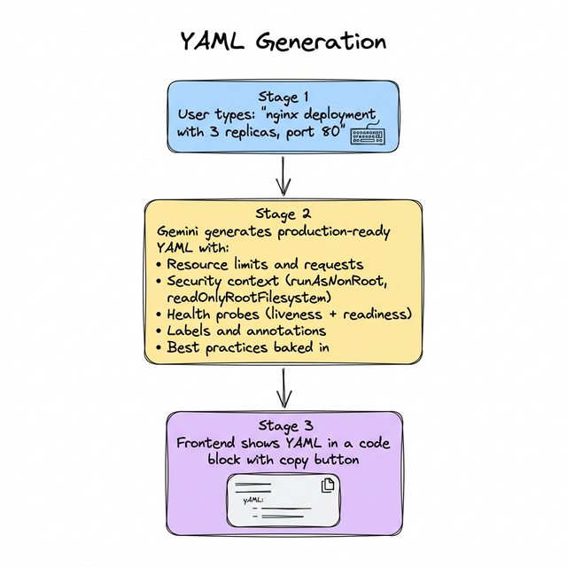

**API:** `POST /api/ai/generate_yaml`
**Pattern:** Direct Prompt

---

### 3.11 Networking AI

**What it does (plain language):**
AI-powered analysis of your Services and Istio VirtualServices — route validation, traffic policy review, dependency mapping, and risk assessment.

**Sub-features:**

| Feature | What It Analyzes | API |
|---|---|---|
| **Network Health** | Overall networking health across all services | `POST /api/ai/network_health` |
| **Service Analyze** | Deep-dive on a specific Service | `POST /api/ai/service_analyze` |
| **Service Dependency** | Maps dependencies between services | `POST /api/ai/service_dependency` |
| **Service Risk** | Security/reliability risk assessment for a service | `POST /api/ai/service_risk` |
| **VS Route Analysis** | Validates Istio VirtualService routing rules | `POST /api/ai/vs_route_analysis` |
| **VS Traffic Policy** | Reviews Istio traffic policies (retries, timeouts, circuit breaking) | `POST /api/ai/vs_traffic_policy` |

**Pattern:** Direct Prompt (all)

---

### 3.12 Health Pulse

**What it does (plain language):**
Namespace-wide health score in one click. Scans all workloads, pods, and events to give a 0-100 score with the top issues that need attention. Think of it as a quick "traffic light" for your entire namespace.

**API:** `POST /api/ai/health_pulse`
**Pattern:** Direct Prompt

---

### 3.13 Job Insights

**What it does (plain language):**
For Kubernetes Jobs that fail or behave unexpectedly, AI analyzes the job spec, pod logs, and events to explain why the job failed and how to fix it.

**API:** `POST /api/ai/job_insights`
**Pattern:** Direct Prompt

---

## 4. Fallback Behavior

> **Every AI feature works without Gemini** — in degraded mode.

If `GCP_PROJECT_ID` is not set or Gemini is unreachable:

| Feature | Fallback Behavior |
|---|---|
| **Diagnose** | Basic health score from replica counts, generic kubectl hints |
| **RCA** | Returns a message asking to configure Gemini |
| **Security Audit** | Heuristic scan (checks for known patterns like privileged containers) |
| **Config Explainer** | Pattern-matching for obvious issues (e.g., `PASSWORD` in env var name) |
| **Resource Optimizer** | Shows resource specs but no AI analysis |
| **Ask AI / Chat** | Returns a message explaining Gemini is required |
| **Self-Heal** | Default restart action with basic status info |

**AI status endpoint:** `GET /api/ai/status` — returns whether Gemini is configured, the error if not, and the last initialization attempt.

---

## 5. Common Questions

### "Does our data leave the cluster?"

**Yes, partially.** When an AI feature is triggered, the relevant Kubernetes data (logs, events, specs) is sent to Google's Vertex AI API over HTTPS. The data is processed by Gemini and a response is returned. Google's Vertex AI:
- Does **not** store prompts or responses (no training on your data)
- Processes in the region you configure (`GCP_REGION`)
- Is covered by your organization's GCP Terms of Service

Data that is **never sent to Gemini:**
- Secret values (only key names are referenced)
- Raw container images
- Cluster credentials

---

### "How much does the Gemini API cost?"

Gemini 2.5 Flash is priced per-token:
- **Input:** $0.15 per 1M tokens
- **Output:** $0.60 per 1M tokens

A typical Diagnose call uses ~2K-4K input tokens and ~500-1K output tokens ≈ **$0.001 per call** (one-tenth of a cent). Even with heavy usage (100 AI calls/day), monthly cost ≈ **$3-5**.

---

### "What if Gemini goes down?"

Every feature has a deterministic fallback (see Section 4). The dashboard fully functions without Gemini — you just lose the AI analysis. The basic monitoring, scaling, and operational features are 100% local.

---

### "Can someone use the chat to run destructive commands?"

**No.** The AI Chat agent has **read-only tools only** — it can list pods, read logs, and inspect configs, but it **cannot** scale, delete, restart, or modify any resources. Destructive actions always go through the dedicated API endpoints with confirmation dialogs.

---

### "How is the prompt engineering handled?"

Each AI feature has a carefully designed prompt that:
1. **Assigns a persona** — "You are a Kubernetes SRE performing a Root Cause Analysis"
2. **Provides real cluster data** — logs, events, specs embedded in the prompt
3. **Specifies exact output schema** — JSON with defined fields, or Markdown with defined headings
4. **Sets guardrails** — rules like "be specific, reference container names, use actual workload names in kubectl commands"
5. **Limits output** — "Return 2-4 risks, 2-3 recommendations" to keep responses focused

The prompts are tuned for Gemini 2.5 Flash specifically and request low-temperature (0.2) for deterministic, accurate responses.

---

### "What Kubernetes permissions does this need?"

Only **namespace-level** permissions (no cluster admin):

| Permission | Resources | Used For |
|---|---|---|
| `get, list, watch` | pods, deployments, statefulsets, daemonsets, jobs, services, configmaps, secrets, events | All read operations + AI context collection |
| `get, list` | serviceaccounts, rolebindings, networkpolicies | Security Audit |
| `create, patch` | deployments/scale, statefulsets/scale | Scale up/down |
| `patch` | deployments, statefulsets | Rolling restart |
| `create` | pods/exec | Terminal access |
| `get, list` | metrics.k8s.io/pods | Resource Optimizer (optional) |
