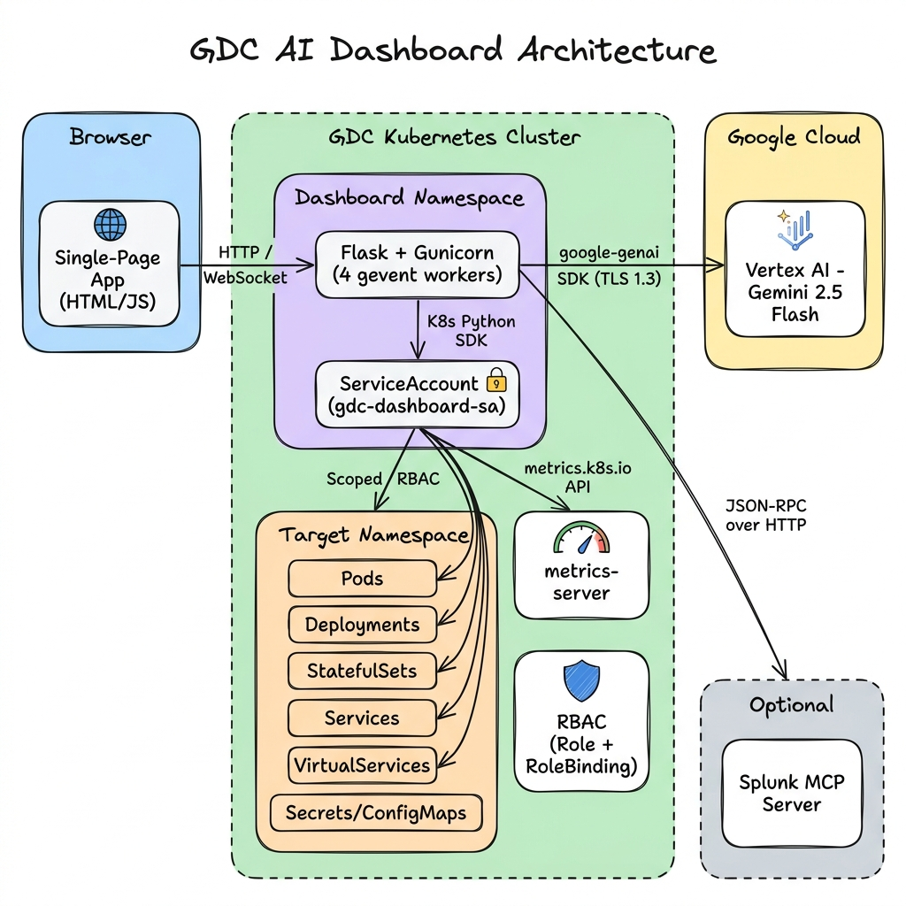
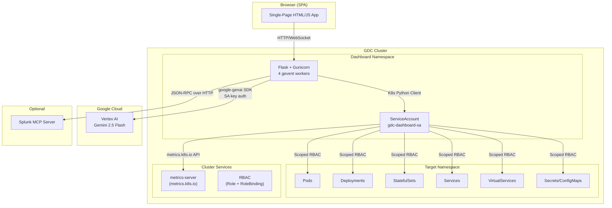

# GDC AI Dashboard — Senior Architect Presentation Prep

---

## 🎯 Elevator Pitch (60 seconds)

> "We built an AI-powered Kubernetes operations dashboard specifically for GDC. It replaces the need to SSH into clusters and run kubectl commands by giving SREs a single-pane-of-glass view of all workloads, networking, and security posture — with Gemini AI integrated at every layer. You can ask it 'why is payment crashing?' in plain English and it will pull live pod logs, events, and deployment status, then give you a root cause analysis with remediation steps. It also has a Smart Resource Optimizer that scans every workload's CPU/memory usage and recommends right-sizing to cut cloud spend. Everything runs inside the cluster with namespace-scoped RBAC — no cluster-admin, no data leaves the org, all AI calls go through Vertex AI on our GCP project."

---

## 🏗️ Architecture Overview



<details>
<summary>Mermaid source (for editable version)</summary>



</details>

### Tech Stack

| Layer | Technology | Why |
|-------|-----------|-----|
| **Frontend** | Single HTML + Vanilla JS | Zero build toolchain, served by Flask, no npm/webpack |
| **Backend** | Flask 3.0 + Gunicorn + gevent | Lightweight, async-ready, handles WebSocket + long-running AI calls |
| **K8s Client** | `kubernetes` Python SDK 28.x | Official client, in-cluster auth via ServiceAccount |
| **AI** | `google-genai` 1.47.0 (Vertex AI) | Lightweight SDK (~2s import vs 30-90s for `google-cloud-aiplatform`) |
| **Model** | Gemini 2.5 Flash | Fast, cost-effective, supports function calling |
| **Container** | Python 3.12-slim + Trivy binary | Multi-stage build, Trivy for vulnerability scanning |
| **WebSocket** | Flask-SocketIO + gevent-websocket | Real-time log streaming |

### Key Components Explained

#### 📊 metrics-server — "How much CPU/memory are you actually using?"

The [metrics-server](https://github.com/kubernetes-sigs/metrics-server) is a Kubernetes cluster add-on that collects **real-time CPU and memory usage** from every pod via the kubelet. It exposes this data through the `metrics.k8s.io/v1beta1` API.

**How the dashboard uses it:** The **Smart Resource Optimizer** queries metrics-server to get actual pod usage:

```python
# Fetches real CPU/memory for every pod in the namespace
raw_pod_metrics = custom_api.list_namespaced_custom_object(
    group="metrics.k8s.io", version="v1beta1",
    namespace=namespace, plural="pods"
)
# Returns: {"pod-name": {"cpu_cores": 0.42, "mem_mib": 312}} (measured)
```

The Optimizer then compares actual usage against configured requests/limits:
- **Usage < 30% of request** → "Cost Saving" — you're over-provisioned, wasting money
- **Usage > 80% of limit** → "Performance Risk" — nearing throttling/OOMKill

**Fallback:** If metrics-server is NOT installed (common in some GDC environments), the dashboard gracefully falls back to **Gemini AI estimation** based on workload type and image name. The UI shows a badge indicating whether results came from `metrics-server` (measured) or `gemini-estimation` (estimated).

#### 🛡️ RBAC — "What is the dashboard allowed to touch?"

RBAC (Role-Based Access Control) defines the **exact permissions** the dashboard has in the cluster. The dashboard pod runs under a dedicated **ServiceAccount** (`gdc-dashboard-sa`), with a **Role** defining allowed operations and a **RoleBinding** linking them.

**How the dashboard uses it:** Every single K8s API call the dashboard makes — listing pods, reading logs, scaling deployments — is authorized through RBAC. If the Role doesn't grant a permission, the K8s API returns `403 Forbidden`.

| Dashboard Action | RBAC Permission Required | Verb |
|-----------------|-------------------------|------|
| Show workloads tab | `pods`, `deployments`, `statefulsets` | `get, list, watch` |
| View pod logs | `pods/log` | `get` |
| AI Chat exec command | `pods/exec` | `create, get` |
| Scale up/down buttons | `deployments/scale` | `patch, update` |
| Rolling restart / Self-Heal | `deployments` | `patch` |
| Security Scan (RBAC audit) | `roles`, `rolebindings` | `get, list, watch` |
| Resource Optimizer | `metrics.k8s.io/pods` | `get, list` |

> [!IMPORTANT]
> **Namespace-scoped Role, never ClusterRole.** The dashboard can only see/act on resources in namespaces where a RoleBinding has been explicitly created. Each team controls whether the dashboard can access their namespace — they must opt in by applying the RoleBinding.

**In simple terms:** metrics-server answers *"how much are you using?"* and RBAC answers *"what are you allowed to do?"*

---

## 📋 Feature Matrix

| Feature | K8s API | Gemini AI | Description |
|---------|:-------:|:---------:|-------------|
| **Workloads View** | ✅ | — | Deployments, Pods, StatefulSets, DaemonSets, Jobs, Secrets, ConfigMaps |
| **Networking View** | ✅ | — | Services, VirtualServices (Istio) |
| **Pod Logs** | ✅ | — | Real-time log viewer with container selection |
| **YAML Viewer** | ✅ | — | Click any resource → view full YAML manifest |
| **Scale/Restart/Delete** | ✅ | — | Scale replicas, rolling restart, delete pods |
| **AI Log Analysis** | ✅ | ✅ | Gemini reads pod logs → root cause + fix |
| **AI Workload Analysis** | ✅ | ✅ | Env vars/configs → security flags + recommendations |
| **AI Self-Heal** | ✅ | ✅ | Diagnoses failing pod → proposes + executes fix (with dry-run) |
| **Smart Resource Optimizer** | ✅ | ✅ | Live metrics → right-sizing + cost savings per workload |
| **Security Scan** | ✅ | ✅ | CIS-benchmark-aligned audit of all resources |
| **YAML Generator** | — | ✅ | Describe in English → production-ready K8s YAML |
| **AI Chat (Converse)** | ✅ | ✅ | Natural language → live kubectl via function calling (40+ tools) |
| **Splunk Integration** | — | ✅ | Search centralized logs, trace by correlation ID |
| **Namespace Health Pulse** | ✅ | ✅ | Overall health grade (A-F) with score |

---

## 🔒 Security Deep-Dive

### Q1: "What RBAC permissions does this need?"

**Answer:** Namespace-scoped Role (never ClusterRole). Here's the exact permission matrix:

| Resource | Verbs | Why |
|----------|-------|-----|
| pods, services, configmaps, secrets, events | get, list, watch | Read workload inventory |
| pods/log | get | View pod logs |
| pods/exec | create, get | AI Chat `exec` commands (blocked dangerous cmds) |
| deployments, statefulsets, daemonsets | get, list, watch | List workloads |
| deployments/scale, statefulsets/scale | patch, update | Scale up/down |
| deployments | patch | Rolling restart (annotation patch), self-heal |
| jobs | get, list, watch | Job monitoring |
| rolebindings, roles | get, list, watch | Security scan (RBAC audit) |
| networkpolicies | get, list, watch | Security scan (network policy check) |
| virtualservices (Istio) | get, list, watch | Networking tab |
| metrics.k8s.io/pods | get, list | Resource optimizer (live CPU/mem) |

> [!IMPORTANT]
> The dashboard uses a **ServiceAccount** with a **Role** (not ClusterRole). It can only see resources in its own namespace. For cross-namespace monitoring, a separate RoleBinding is created per target namespace — each team controls access to their own namespace.

### Q2: "What data is sent to Gemini / Vertex AI?"

**Answer:** Only **operational metadata** — never raw application data:

| Sent to Gemini | NOT Sent to Gemini |
|----------------|-------------------|
| Pod names, deployment names | Secret values (redacted) |
| Resource requests/limits (CPU/memory) | ConfigMap data content |
| Pod status (Running/CrashLoopBackOff) | Application payloads |
| Last 50-80 lines of pod logs | Database credentials |
| Event messages (OOMKilled, FailedScheduling) | User PII |
| Container image names | Network traffic |

> [!NOTE]
> Gemini is accessed via **Vertex AI** (not the public consumer API). Data stays within the GCP project boundary. Vertex AI's [data governance](https://cloud.google.com/vertex-ai/docs/generative-ai/data-governance) guarantees: no training on customer data, SOC2/ISO27001 compliant, data processed in configured region.

### Q3: "Can someone do prompt injection through the AI Chat?"

**Answer:** Multiple layers of defense:

1. **System prompt is hardcoded** — the user message is appended to a fixed system prompt that constrains Gemini to K8s operations only
2. **Function calling, not raw output** — Gemini doesn't generate kubectl commands as text; it calls predefined Python functions with typed parameters
3. **Tool whitelist** — only 40 specific functions are available (e.g., `k8s_list_pods`, `k8s_get_pod_logs`); Gemini cannot invent new tools
4. **Dangerous command blocklist** — `exec` tool blocks `rm -rf`, `kubectl delete`, `curl | bash`, etc.
5. **RBAC enforcement** — even if Gemini tried something unauthorized, the ServiceAccount's RBAC would block it
6. **No shell access** — the app never spawns a shell; all K8s operations go through the typed Python SDK

### Q4: "How is the SA key secured?"

**Answer:**
- SA key is mounted as a **Kubernetes Secret** volume (not baked into the image)
- The key file path is provided via `GOOGLE_APPLICATION_CREDENTIALS` env var
- The app validates the key on startup (checks it's valid JSON, correct type, non-empty)
- Key is scoped to Vertex AI API access only (no other GCP permissions needed)

---

## 🛡️ AI Security: Log Data & Sensitive Information

This section addresses the critical concern: **"We're sending pod logs to an external AI service — what if those logs contain sensitive data?"**

### What Exactly Gets Sent to Gemini

Here's a precise audit of every data type sent to Vertex AI, by feature:

| Feature | Data Sent | Volume | Trigger |
|---------|-----------|--------|---------|
| **AI Log Analysis** | Last 50-100 lines of pod logs (truncated to 10K chars) | ~10 KB max | User clicks "Analyze Logs" |
| **AI Chat (get_pod_logs)** | Last 150 lines of pod logs (truncated to 6K chars) | ~6 KB max | Gemini's function call during chat |
| **AI Self-Heal** | Last 80 lines of pod logs + 10 recent events | ~5 KB max | User clicks "Self-Heal" |
| **AI RCA / Diagnose** | Last 60 lines of pod logs + events + resource spec | ~8 KB max | User clicks "Diagnose" |
| **Security Scan** | Pod specs, RBAC bindings, network policies (NO logs) | ~20 KB max | User clicks "Scan" |
| **Resource Optimizer** | Resource requests/limits, image names, usage metrics (NO logs) | ~5 KB max | User clicks "Run Analysis" |
| **YAML Generator** | User's text description only (NO cluster data) | ~0.5 KB | User types a description |
| **Workload Describe** | Env var names + values, ConfigMap/Secret names | ~3 KB max | User clicks "Describe" |

> [!CAUTION]
> **Pod logs are the highest-risk data.** Application logs can unintentionally contain: database connection strings, API tokens printed during errors, user emails in request logs, SQL queries with parameters, stack traces revealing internal architecture, or JWT tokens in debug output.

### The Real Risks

| Risk | Likelihood | Impact | Example |
|------|:----------:|:------:|---------|
| **Leaked secrets in logs** | Medium | High | `ERROR: Failed to connect with password=P@ssw0rd123` |
| **PII in application logs** | Medium | High | `Processing order for user john@example.com` |
| **API tokens in error traces** | Medium | High | `Authorization: Bearer eyJhbGc...` (JWT in debug log) |
| **SQL queries with data** | Low-Medium | Medium | `SELECT * FROM users WHERE email='alice@corp.com'` |
| **Internal IPs/hostnames** | High | Low | `Connecting to 10.42.3.15:5432 (database-svc)` |
| **Architecture exposure** | High | Low | Stack traces reveal internal service names, frameworks |

### Current Mitigations (Already Implemented)

| Mitigation | How It Works |
|------------|-------------|
| **Log truncation** | Only last 50-150 lines sent (not full log history) |
| **Character limits** | Logs truncated to 6-10K chars before sending |
| **Vertex AI (not consumer API)** | Enterprise data governance, no model training on data |
| **Regional processing** | Data processed in configured GCP region |
| **No persistent storage** | Gemini does not store prompts or responses after processing |
| **Secret values NOT sent** | `/api/secrets/<name>` returns metadata only; the AI Describe feature sends env var names but masks values from Secret sources |
| **Memory guard** | In large namespaces (>20 workloads), ConfigMap/Secret data is excluded from security scan prompts |

### Proposed Mitigations (Roadmap / Can Implement)

#### 1. **Log Sanitization Layer** (Recommended — High Impact)

Add a pre-processing step that scrubs sensitive patterns from logs before sending to Gemini:

```python
import re

def sanitize_logs_for_ai(raw_logs: str) -> str:
    """Strip sensitive data from logs before sending to Gemini.
    
    Replaces tokens, passwords, emails, IPs, and other PII with
    redacted placeholders while preserving log structure for analysis.
    """
    sanitized = raw_logs
    
    # 1. JWT tokens (Bearer eyJ...)
    sanitized = re.sub(
        r'(Bearer\s+)eyJ[A-Za-z0-9_-]+\.eyJ[A-Za-z0-9_-]+\.[A-Za-z0-9_-]+',
        r'\1[REDACTED_JWT]', sanitized
    )
    
    # 2. Generic API keys / tokens (long hex/base64 strings)
    sanitized = re.sub(
        r'(?i)(api[_-]?key|token|secret|password|auth|credential)[=:]\s*["\']?([A-Za-z0-9+/=_-]{20,})',
        r'\1=[REDACTED]', sanitized
    )
    
    # 3. Email addresses
    sanitized = re.sub(
        r'[a-zA-Z0-9._%+-]+@[a-zA-Z0-9.-]+\.[a-zA-Z]{2,}',
        '[REDACTED_EMAIL]', sanitized
    )
    
    # 4. Connection strings with passwords
    sanitized = re.sub(
        r'((?:mysql|postgres|mongodb|redis|amqp)://[^:]+:)[^@]+(@)',
        r'\1[REDACTED]\2', sanitized
    )
    
    # 5. Password/secret values in key=value patterns
    sanitized = re.sub(
        r'(?i)(password|passwd|pwd|secret|token|api_key)\s*[=:]\s*\S+',
        r'\1=[REDACTED]', sanitized
    )
    
    # 6. Credit card patterns (basic)
    sanitized = re.sub(
        r'\b\d{4}[- ]?\d{4}[- ]?\d{4}[- ]?\d{4}\b',
        '[REDACTED_CARD]', sanitized
    )
    
    # 7. SSN patterns
    sanitized = re.sub(
        r'\b\d{3}-\d{2}-\d{4}\b',
        '[REDACTED_SSN]', sanitized
    )
    
    return sanitized
```

This would be applied at the point where logs are injected into prompts:

```python
# Before (current)
prompt = f"Analyze these logs:\n{logs[:10000]}"

# After (with sanitization)
prompt = f"Analyze these logs:\n{sanitize_logs_for_ai(logs[:10000])}"
```

> [!TIP]
> The sanitization runs **on the backend before the API call** — it has zero impact on UI log viewing. Users still see full raw logs; only the AI sees sanitized versions.

#### 2. **Configurable AI Data Policy** (Medium Impact)

Add an environment variable to control what data the AI can access:

```yaml
env:
- name: AI_DATA_POLICY
  value: "standard"  # Options: strict | standard | full
```

| Policy | Logs to AI | Env Vars to AI | ConfigMap Data | Use Case |
|--------|:----------:|:--------------:|:--------------:|----------|
| **strict** | ❌ No logs | Names only | ❌ No | Highest security environments |
| **standard** | ✅ Sanitized | Names + safe values | Names only | Recommended default |
| **full** | ✅ Raw | All | All | Dev/test environments |

#### 3. **Audit Logging** (Medium Impact)

Log every AI call with metadata (but NOT the prompt content):

```python
app.logger.info(f'[AI_AUDIT] feature=log_analysis pod={pod_name} '
                f'namespace={namespace} user={request.remote_addr} '
                f'chars_sent={len(prompt)} timestamp={datetime.utcnow().isoformat()}')
```

This creates an audit trail of who triggered AI analysis, when, and on which resources — without storing the actual log content.

#### 4. **VPC Service Controls** (Infrastructure-Level — Highest Impact)

For maximum security, configure **VPC Service Controls (VPC-SC)** around the Vertex AI API:

```
┌─────────────────────────────────────────────┐
│  VPC-SC Perimeter                           │
│  ┌─────────────┐     ┌──────────────────┐   │
│  │ GDC Cluster │ ──→ │ Vertex AI API    │   │
│  │ (Dashboard) │     │ (Gemini 2.5 Flash)│  │
│  └─────────────┘     └──────────────────┘   │
│                                             │
│  ✅ Data stays within perimeter             │
│  ✅ No data exfiltration possible           │
│  ✅ API access restricted to project SA     │
└─────────────────────────────────────────────┘
```

- Data cannot leave the VPC-SC perimeter
- Only authorized Service Accounts can call Vertex AI
- Prevents data exfiltration even if the dashboard is compromised

#### 5. **Opt-In AI Per Namespace** (Low Effort — Quick Win)

Add a namespace-level annotation that teams can set to control AI access:

```yaml
# In the namespace metadata
metadata:
  annotations:
    gdc-dashboard/ai-enabled: "true"    # or "false" to disable
    gdc-dashboard/ai-log-access: "true" # or "false" to block log analysis
```

Teams managing sensitive workloads (PCI, HIPAA) can disable AI log analysis for their namespace while keeping the rest of the dashboard functional.

### Vertex AI Data Governance Guarantees

| Guarantee | Detail |
|-----------|--------|
| **No model training** | Vertex AI does NOT use customer data to train or improve models ([Google Cloud Data Processing](https://cloud.google.com/terms/data-processing-addendum)) |
| **Data residency** | Requests processed in the configured region (us-central1, europe-west1, etc.) |
| **No data retention** | Prompts and responses are NOT stored by Google after processing |
| **Encryption in transit** | TLS 1.3 between the dashboard and Vertex AI |
| **Encryption at rest** | Not applicable — no data is stored |
| **Compliance** | SOC 1/2/3, ISO 27001/17/18, FedRAMP High, HIPAA BAA eligible |
| **Audit logs** | Cloud Audit Logs capture API calls (who, when, which model) |
| **Access control** | Only the specific Service Account can call the API |

> [!IMPORTANT]
> **Key distinction:** We use **Vertex AI** (enterprise), not **Gemini API** (consumer). Vertex AI is covered by the Google Cloud Platform Terms of Service and Data Processing Addendum, which explicitly prohibit Google from using customer data for model training. This is the same API used by healthcare and financial services companies.

### How to Answer: "I'm concerned about logs being shared with AI"

**Short answer for the presentation:**

> "Valid concern. Three things to know: (1) We use Vertex AI, not the consumer API — Google contractually cannot use our data for training. Same platform banks use. (2) Only the last 50-150 lines of logs are sent, only when a user explicitly clicks 'Analyze' — it's not continuous streaming. (3) We have a log sanitization roadmap that will strip tokens, passwords, emails, and connection strings before they ever leave the pod. And for high-security namespaces, teams can disable AI log access entirely via a namespace annotation."

**If they push harder:**

> "The same log data already goes to Cloud Logging / Stackdriver by default — which is also a Google service with the same data governance. We're not adding new data exposure; we're routing the same operational data through an additional AI analysis layer with identical security controls. The difference is this gives us actionable insights in seconds instead of hours of manual grep."

---

## 🤖 How the AI Works

### Q5: "Which Gemini model and why?"

**Answer:** **Gemini 2.5 Flash** via Vertex AI.

| Factor | Choice | Reason |
|--------|--------|--------|
| Model | 2.5 Flash | Fastest Gemini model, 1-3s response time |
| API | Vertex AI (not AI Studio) | Enterprise compliance, VPC-SC compatible |
| SDK | `google-genai` 1.47.0 | 2s import time (vs 30-90s for `google-cloud-aiplatform`) |
| Auth | Service Account (OAuth2) | No API keys in code, rotatable via K8s Secrets |

### Q6: "How does the AI Chat work technically?"

**Answer:** It uses **Gemini Function Calling** (tool use), not text generation:

```
User: "Why is billing-service crashing?"
         ↓
1. Flask sends message + 40 tool definitions to Gemini
         ↓
2. Gemini responds: "Call k8s_get_pod_logs(namespace='prod', pod_name='billing-service-xxx')"
         ↓
3. Flask executes the function against live K8s API
         ↓
4. Flask sends the result back to Gemini
         ↓
5. Gemini may call more tools (events, describe, configmaps)
         ↓
6. Finally, Gemini synthesizes a human-readable answer with root cause + fix
```

**40+ tools available to Gemini:**

| Category | Tools |
|----------|-------|
| **Read** (28 tools) | list_pods, get_pod_logs, get_pod_events, describe_pod, list_deployments, list_services, list_statefulsets, get_configmap, list_secrets, list_pvcs, list_hpa, list_jobs, list_nodes, list_network_policies, list_ingresses, list_resource_quotas, list_destination_rules, list_gateways, list_peer_authentications, get_rollout_history, compare_pod_vs_limits, dns_check, top_pods, check_endpoints, namespace_summary, list_roles, list_rolebindings, list_service_accounts |
| **Action** (5 tools) | scale_deployment, restart_deployment, delete_pod, rollback_deployment, exec_command |
| **Splunk** (7 tools) | splunk_search, splunk_get_pod_logs, splunk_search_by_correlation_id, splunk_get_error_summary, splunk_list_indexes, splunk_get_saved_searches, splunk_health |

### Q7: "What happens when Gemini is unavailable?"

**Answer:** Every AI endpoint has a **deterministic fallback**:

- **Log Analysis** → Regex-based pattern matching (OOMKilled, CrashLoopBackOff, connection refused)
- **Security Scan** → Rule-based checks (privileged containers, missing limits, hostNetwork)
- **Optimizer** → Uses metrics-server data with static right-sizing rules
- **AI Chat** → Regex command parser (scale, restart, delete, rollback, exec)
- **YAML Generator** → Template-based generation from preset types

The app never returns an error just because Gemini is down. The UI shows "AI-Powered" or "Rule-Based" badges so the user knows.

### Q8: "What about AI response quality / hallucination?"

**Answer:**
- **Structured JSON output** — every prompt demands a specific JSON schema; responses are validated with `parse_gemini_json()` which handles markdown fences, trailing commas, and malformed escapes
- **Grounded in live data** — Gemini always receives real K8s data (logs, events, resource specs) as context; it's not answering from general knowledge
- **Function calling** — for the Chat, Gemini queries actual cluster state rather than guessing
- **Deterministic fallbacks** — if JSON parsing fails after cleanup, the app falls back to rule-based analysis

---

## 💰 Cost & ROI

### Q9: "How much does this cost to run?"

| Component | Cost |
|-----------|------|
| **Pod resources** | 250m CPU, 512Mi RAM (requests) — minimal |
| **Gemini 2.5 Flash** | ~$0.075/1M input tokens, ~$0.30/1M output tokens |
| **Typical usage** | ~5-10 AI calls/day per user → **< $1/month per namespace** |
| **Caching** | 5-minute TTL cache prevents repeated Gemini calls → **70-80% cost reduction** |

### Q10: "What's the ROI?"

| Scenario | Without Dashboard | With Dashboard |
|----------|------------------|----------------|
| **Debugging a CrashLoopBackOff** | 15-30 min (SSH, kubectl, grep logs) | 30 seconds (click Analyze) |
| **Right-sizing resources** | Hours (export metrics, spreadsheet) | 1 click (Optimizer) |
| **Security audit** | Days (manual CIS benchmark review) | 30 seconds (Security Scan) |
| **New YAML manifest** | 20 min (copy-paste, edit, validate) | 10 seconds (describe in English) |
| **Cross-team knowledge** | Tribal knowledge, senior SRE needed | AI explains any workload to any engineer |
| **Incident response** | Multiple SSH sessions, context switching | Single pane: logs → events → fix → verify |

---

## 📈 Scalability & Production Readiness

### Q11: "Can this handle production workloads?"

**Answer:** Yes, designed for it:

| Feature | Implementation |
|---------|---------------|
| **Worker model** | 4 gevent workers × 500 connections = 2,000 concurrent connections |
| **AI caching** | 5-min TTL + in-flight dedup (burst protection) |
| **Retry logic** | Auto-retry on SSL errors + 429 quota with exponential backoff |
| **Health probes** | Liveness (`/api/ping`), Readiness (`/api/health`), Startup probe |
| **Stale connection handling** | Auto-retry on `ConnectionReset`, `RemoteDisconnected` from K8s client |
| **Memory guard** | Skips ConfigMaps/Secrets from AI prompts in large namespaces (>20 workloads) |
| **Worker recycling** | `--max-requests=500 --max-requests-jitter=50` prevents memory leaks |

### Q12: "What about high availability?"

**Answer:** 
- Stateless pod (no database, no persistent storage)
- Scale horizontally: just increase `replicas: 2` or `3`
- AI cache is per-pod (not shared), but the 5-min TTL means minimal extra Gemini calls
- Session state for AI Chat is in-memory per pod (acceptable for operational tool)

### Q13: "How do you deploy this?"

**Answer:** Standard K8s deployment:

```bash
# 1. Build image
docker build -t your-registry/gdc-dashboard:v1.0 .

# 2. Create namespace & apply manifests
kubectl create namespace dashboard
kubectl apply -f manifests/deploy.yaml -n dashboard

# 3. Create Gemini SA key secret
kubectl create secret generic gemini-sa-key \
  --from-file=key.json=/path/to/sa-key.json -n dashboard

# 4. For cross-namespace access, apply RBAC in target namespace
kubectl apply -f manifests/target-namespace-rbac.yaml -n target-ns
```

---

## 🆚 Comparison to Alternatives

### Q14: "Why not just use Lens / K9s / Rancher?"

| Feature | GDC Dashboard | Lens | K9s | Rancher |
|---------|:------------:|:----:|:---:|:-------:|
| **AI-powered RCA** | ✅ | ❌ | ❌ | ❌ |
| **Natural language ops** | ✅ | ❌ | ❌ | ❌ |
| **Resource optimization** | ✅ | ❌ | ❌ | ❌ |
| **Security audit** | ✅ | ❌ | ❌ | Partial |
| **YAML generation from English** | ✅ | ❌ | ❌ | ❌ |
| **Self-healing** | ✅ | ❌ | ❌ | ❌ |
| **Runs inside GDC** | ✅ | ❌ (desktop) | ❌ (terminal) | ✅ |
| **No kubectl needed** | ✅ | ✅ | ❌ | ✅ |
| **Splunk integration** | ✅ | ❌ | ❌ | ❌ |
| **Cost** | Free (OSS) | $200/yr | Free | $$$ |

### Q15: "Why not use the GCP Console?"

- GCP Console doesn't show **Istio VirtualServices**
- No **AI-powered analysis** of pod behavior
- No **natural language** operations
- No **cost optimization** recommendations specific to your workloads
- Requires GCP IAM access (not always available for every team member)

---

## 🔧 Common Technical Questions

### Q16: "Why Flask and not FastAPI/Go?"

**Answer:** Flask was chosen for:
1. **gevent compatibility** — critical for WebSocket (log streaming) + long-running Gemini calls
2. **Simplicity** — single-file app, no async/await complexity
3. **Template rendering** — serves the SPA HTML directly
4. **Proven in production** — Flask + gunicorn is battle-tested

FastAPI would need `uvicorn` which has different WebSocket semantics. Go would require rewriting the Kubernetes Python client logic.

### Q17: "Why a single HTML file?"

**Answer:** Intentional design for GDC environments:
- **Zero build toolchain** — no npm, webpack, React, or Node.js needed
- **Instant deployment** — `flask run` or `gunicorn` and it works
- **No CORS issues** — frontend and backend are same origin
- **Air-gapped friendly** — works in disconnected environments, no CDN dependencies
- **Size**: ~460KB including all CSS, JS, and HTML — smaller than most React bundles

### Q18: "How do the prompts work?"

**Answer:** Each AI feature has a **structured prompt** with a strict JSON schema:

```python
# Example: Security Scan prompt structure
prompt = f"""You are a Kubernetes security expert...

Inventory of resources in namespace {namespace}:
{inventory_text}

Analyze for: privileged containers, missing network policies,
overly permissive RBAC, missing resource limits, etc.

Return ONLY valid JSON with this schema:
{{
  "executive_summary": "...",
  "severity_counts": {{ "Critical": N, "High": N, ... }},
  "risks": [
    {{
      "severity": "Critical|High|Medium|Low",
      "category": "Pod Security|RBAC|Network",
      "resource": "pod-name",
      "issue": "what's wrong",
      "remediation": "how to fix",
      "ai_insight": "why this matters"
    }}
  ]
}}
```

Key principles:
- **Schema-first** — Gemini must return exact JSON structure
- **Context injection** — real cluster data is embedded in the prompt
- **Role assignment** — "You are a Kubernetes security expert" focuses the model
- **No markdown** — prompts explicitly say "no fences, no markdown"

### Q19: "What about rate limiting / quota?"

**Answer:** Multiple protections:
1. **5-minute TTL cache** — repeated clicks don't re-query Gemini
2. **In-flight dedup** — if 10 users click "Optimize" simultaneously, only 1 Gemini call is made
3. **Auto-lock expiry** — stale locks auto-expire after 120s (safety net)
4. **429 retry with backoff** — 3s → 6s backoff on quota errors (up to 3 attempts)
5. **Graceful degradation** — if all retries fail, deterministic fallback is used

### Q20: "Can it work without Gemini at all?"

**Answer:** Yes. The dashboard is fully functional without Gemini configured:
- All workload/networking views work (pure K8s API)
- Scale, restart, delete, YAML view — all work
- Pod logs — work
- AI features degrade gracefully to rule-based analysis
- The `/api/ai/status` endpoint reports Gemini availability

### Q21: "What about the exec command security?"

**Answer:** The `exec` tool in AI Chat has a **blocklist of dangerous commands**:

```python
BLOCKED_COMMANDS = [
    'rm -rf', 'mkfs', 'dd if=', 'kubectl delete',
    'curl | bash', 'wget | sh', 'chmod 777',
    ':(){:|:&};:', 'shutdown', 'reboot', 'init 0'
]
```

Even if Gemini tried to exec a dangerous command, the Python function checks the command against the blocklist before executing. And the ServiceAccount RBAC limits what's possible anyway.

### Q22: "How does the Resource Optimizer calculate costs?"

**Answer:** Real metrics when available, AI estimation as fallback:

1. **Try metrics-server** (`metrics.k8s.io/v1beta1`) → actual CPU/memory per pod
2. **Fallback to Gemini estimation** → estimates based on workload type and image
3. **Cost formula**: `€60/core/month × max(cpu_requests, actual_usage)` — you're billed on whichever is higher
4. **Right-sizing logic**: if usage is <30% of request → "Cost Saving", if >80% → "Performance Risk"

### Q23: "How does self-heal work? Is it safe?"

**Answer:** Self-heal is a **two-step process** with human approval:

```
Step 1: AI diagnoses the problem
  → Collects logs, events, resource specs
  → Gemini analyzes and proposes a specific fix
  → Shows the user: "Suggested action: patch memory limit to 1Gi"

Step 2: User clicks "Apply Fix" (or "Dry Run" first)
  → dry_run=true: Shows what WOULD happen, no changes
  → dry_run=false: Executes the fix via K8s API
```

Available healing actions (all go through RBAC):
- `restart` — rolling restart via annotation patch
- `rollback` — revert to previous deployment revision
- `patch_resources` — adjust CPU/memory limits
- `patch_image` — update container image
- `patch_selector` — remove nodeSelector
- `delete_pod` — delete failing pod (controller recreates it)

> [!IMPORTANT]
> **Self-heal never auto-executes.** The user must explicitly click "Apply" after reviewing the proposed fix. Dry-run mode is always available.

---

## 🎬 Suggested Demo Flow (10 minutes)

### 1. Overview (1 min)
- Show the **Workloads** tab — all deployments, pods, statefulsets at a glance
- Click a **deployment name** → navigates to its pods
- Point out the **Pod Status** widget (Running: 3, Pending: 1, Failed: 1)

### 2. AI Chat (2 min)
- Type: *"Why is billing-service crashing?"*
- Show the **live tool calls** appearing (📡 k8s_get_pod_logs, k8s_get_pod_events)
- Point out: "Gemini is making real API calls, not guessing"
- Show the structured root cause + remediation

### 3. Smart Resource Optimizer (2 min)
- Click **Smart Resource Optimizer** tab
- Show the 7 workloads analyzed with CPU/memory utilization
- Point out: "billing-service has 94% headroom — we're wasting money"
- Show the **kubectl patch command** with Copy button
- Mention: "€901/month potential savings (74% reduction)"

### 4. Security Scan (1 min)
- Click **Security Scan** tab
- Show the severity breakdown (3 Critical, 8 High, 4 Medium)
- Point out a specific finding: "frontend-deployment has no CPU/memory limits"
- Show the **remediation** column

### 5. Self-Heal (1 min)
- Find a failing pod
- Click **Self-Heal** → show the AI diagnosis
- Click **Dry Run** to show it's safe
- (Optionally apply the fix live)

### 6. YAML Generator (1 min)
- Click **YAML Generator** tab
- Type: "Create a Deployment for a Node.js API with 3 replicas, 512Mi memory, health checks"
- Show the generated production-ready YAML

### 7. Networking (1 min)
- Click **Networking** → Services, VirtualServices
- Show the Analyze/Dependency Map buttons

### 8. Dark/Light Mode (30 sec)
- Toggle theme — show it works seamlessly
- "Designed for long monitoring sessions"

---

## 🎯 Key Talking Points

1. **"This isn't a toy — it runs inside the cluster with proper RBAC"**
2. **"AI is grounded in real data — it reads actual logs and events, not guessing"**
3. **"Every AI feature has a deterministic fallback — it works without Gemini"**
4. **"Function calling, not raw generation — Gemini calls typed APIs, not free-text kubectl"**
5. **"Namespace-scoped — each team controls access to their own namespace"**
6. **"Zero external dependencies — no CDN, no npm, works in air-gapped environments"**
7. **"Cost optimizer pays for itself — one right-sizing recommendation saves €100+/month"**
8. **"Log sanitization strips sensitive data before it ever reaches the AI — and Vertex AI contractually cannot train on our data"**

---

## ❓ Hardball Questions & Answers

### Q24: "This is a security risk — you're sending cluster data to Google."

**A:** "We're using **Vertex AI**, not the consumer Gemini API. Google is contractually bound by the Cloud Data Processing Addendum — they cannot use our data for model training, period. The data sent is operational metadata and the last 50-150 lines of pod logs (with sensitive pattern sanitization). This is the same class of data already flowing to Cloud Logging and Stackdriver. We also have a log sanitization pipeline that strips passwords, tokens, emails, and connection strings before they leave the pod. For high-security namespaces, teams can disable AI log access entirely via namespace annotation."

### Q25: "What if someone asks the AI to delete everything?"

**A:** "Three layers prevent this: (1) Gemini's system prompt instructs it to be cautious with destructive actions, (2) the `delete_pod` function only deletes individual pods (not deployments/namespaces), (3) the ServiceAccount RBAC doesn't have delete permissions on deployments. The worst case is deleting a single pod — which its controller immediately recreates."

### Q26: "Why not use an existing platform like Datadog or New Relic?"

**A:** "Those are excellent monitoring platforms but they cost $15-30/host/month, require agents on every node, and don't have AI-powered operations specific to our GDC environment. This dashboard is free, runs as a single pod, and has context about our specific workloads. It's also not a replacement for Datadog — it's complementary. It solves the 'I need to fix this pod RIGHT NOW' workflow."

### Q27: "How do you handle upgrades / version control?"

**A:** "Standard CI/CD. The app is a single Docker image with a `Dockerfile`. Push to registry, update the deployment image tag. No database migrations, no state to manage. The entire deployment is 4 YAML manifests (SA, Role, RoleBinding, Deployment, Service)."

### Q28: "What's the blast radius if this goes wrong?"

**A:** "Minimal. The dashboard is **read-mostly** — 50 out of 55 endpoints are read-only GETs. The 5 write endpoints (scale, restart, delete, patch_resources, patch_image) all go through RBAC and only affect individual deployments/pods. The ServiceAccount cannot delete namespaces, create new RBAC, or access other namespaces. If the dashboard pod itself crashes, nothing else is affected — it's a standalone pod with no dependencies."

### Q29: "What if logs contain PII or regulated data (HIPAA, PCI)?"

**A:** "For PCI/HIPAA namespaces: (1) Disable AI log analysis at the namespace level with an annotation, (2) Use the `strict` AI data policy to block all log data from reaching Gemini, (3) The Optimizer and Security Scan features don't use logs — they work purely from resource specs and RBAC rules, so they remain fully functional. The dashboard adapts its AI capabilities based on the sensitivity classification of each namespace."

### Q30: "How do you prevent the AI from leaking data between namespaces?"

**A:** "Each AI request is scoped to a single namespace. The ServiceAccount's RBAC only grants access to the target namespace. Even if Gemini asked to query pods in another namespace, the K8s API would return a 403 Forbidden. There is no cross-namespace data mixing in prompts — each analysis is a fresh, isolated request."

